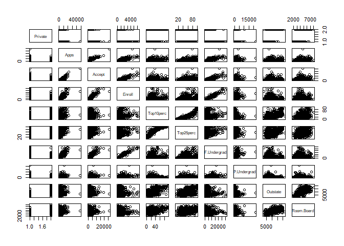
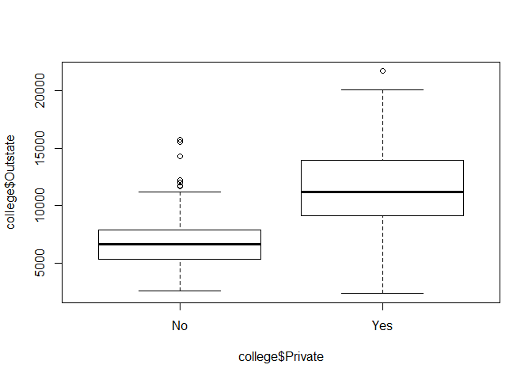
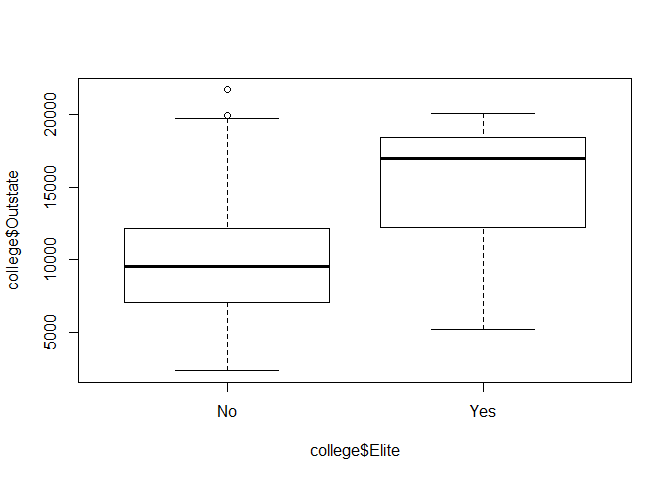
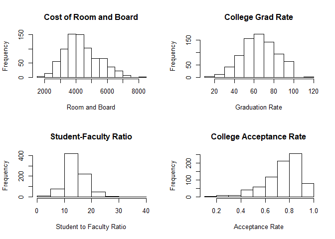

# Question 2.4.8


## Solution.

### Part (a)


```r
college <- read.csv("College.csv")
```

### Part (b)

```r
rownames(college) <- college[,1]
fix(college)

college <- college[,-1]
fix(college)
```

### Part (c)
#### (c) i.

```r
summary(college)
```

```
##  Private        Apps           Accept          Enroll       Top10perc    
##  No :212   Min.   :   81   Min.   :   72   Min.   :  35   Min.   : 1.00  
##  Yes:565   1st Qu.:  776   1st Qu.:  604   1st Qu.: 242   1st Qu.:15.00  
##            Median : 1558   Median : 1110   Median : 434   Median :23.00  
##            Mean   : 3002   Mean   : 2019   Mean   : 780   Mean   :27.56  
##            3rd Qu.: 3624   3rd Qu.: 2424   3rd Qu.: 902   3rd Qu.:35.00  
##            Max.   :48094   Max.   :26330   Max.   :6392   Max.   :96.00  
##    Top25perc      F.Undergrad     P.Undergrad         Outstate    
##  Min.   :  9.0   Min.   :  139   Min.   :    1.0   Min.   : 2340  
##  1st Qu.: 41.0   1st Qu.:  992   1st Qu.:   95.0   1st Qu.: 7320  
##  Median : 54.0   Median : 1707   Median :  353.0   Median : 9990  
##  Mean   : 55.8   Mean   : 3700   Mean   :  855.3   Mean   :10441  
##  3rd Qu.: 69.0   3rd Qu.: 4005   3rd Qu.:  967.0   3rd Qu.:12925  
##  Max.   :100.0   Max.   :31643   Max.   :21836.0   Max.   :21700  
##    Room.Board       Books           Personal         PhD        
##  Min.   :1780   Min.   :  96.0   Min.   : 250   Min.   :  8.00  
##  1st Qu.:3597   1st Qu.: 470.0   1st Qu.: 850   1st Qu.: 62.00  
##  Median :4200   Median : 500.0   Median :1200   Median : 75.00  
##  Mean   :4358   Mean   : 549.4   Mean   :1341   Mean   : 72.66  
##  3rd Qu.:5050   3rd Qu.: 600.0   3rd Qu.:1700   3rd Qu.: 85.00  
##  Max.   :8124   Max.   :2340.0   Max.   :6800   Max.   :103.00  
##     Terminal       S.F.Ratio      perc.alumni        Expend     
##  Min.   : 24.0   Min.   : 2.50   Min.   : 0.00   Min.   : 3186  
##  1st Qu.: 71.0   1st Qu.:11.50   1st Qu.:13.00   1st Qu.: 6751  
##  Median : 82.0   Median :13.60   Median :21.00   Median : 8377  
##  Mean   : 79.7   Mean   :14.09   Mean   :22.74   Mean   : 9660  
##  3rd Qu.: 92.0   3rd Qu.:16.50   3rd Qu.:31.00   3rd Qu.:10830  
##  Max.   :100.0   Max.   :39.80   Max.   :64.00   Max.   :56233  
##    Grad.Rate     
##  Min.   : 10.00  
##  1st Qu.: 53.00  
##  Median : 65.00  
##  Mean   : 65.46  
##  3rd Qu.: 78.00  
##  Max.   :118.00
```

#### (c) ii.
A bit iffy here because it produces so many graphs, but I guess that kind of makes sense? 


```r
pairs(college[,1:10])
```

<!-- -->

#### (c) iii.

```r
plot(college$Outstate ~ college$Private)
```

<!-- -->

#### (c) iv.

```r
Elite <- rep("No", nrow(college))
Elite[college$Top10perc > 50] <- "Yes"
Elite <- as.factor(Elite)
college <- data.frame(college, Elite)
summary(college$Elite)
```

```
##  No Yes 
## 699  78
```

```r
plot(college$Outstate ~ college$Elite)
```

<!-- -->

#### (c) v.
I found that there was an interesting point where graduation rate was bigger than 100, so I wanted to include that.


```r
par(mfrow=c(2,2))

hist(college$Room.Board, main="Cost of Room and Board", xlab="Room and Board")

hist(college$Grad.Rate, main="College Grad Rate", xlab="Graduation Rate")

hist(college$S.F.Ratio, main="Student-Faculty Ratio", xlab="Student to Faculty Ratio")

hist(college$Accept / college$Apps, main="College Acceptance Rate", xlab="Acceptance Rate")
```

<!-- -->

#### (c) vi.
As pointed out above, I saw there was a place where the Graduation Rate exceeded 100% which shouldn't be possible.


```r
college$Grad.Rate > 100
```

```
##   [1] FALSE FALSE FALSE FALSE FALSE FALSE FALSE FALSE FALSE FALSE FALSE
##  [12] FALSE FALSE FALSE FALSE FALSE FALSE FALSE FALSE FALSE FALSE FALSE
##  [23] FALSE FALSE FALSE FALSE FALSE FALSE FALSE FALSE FALSE FALSE FALSE
##  [34] FALSE FALSE FALSE FALSE FALSE FALSE FALSE FALSE FALSE FALSE FALSE
##  [45] FALSE FALSE FALSE FALSE FALSE FALSE FALSE FALSE FALSE FALSE FALSE
##  [56] FALSE FALSE FALSE FALSE FALSE FALSE FALSE FALSE FALSE FALSE FALSE
##  [67] FALSE FALSE FALSE FALSE FALSE FALSE FALSE FALSE FALSE FALSE FALSE
##  [78] FALSE FALSE FALSE FALSE FALSE FALSE FALSE FALSE FALSE FALSE FALSE
##  [89] FALSE FALSE FALSE FALSE FALSE FALSE FALSE  TRUE FALSE FALSE FALSE
## [100] FALSE FALSE FALSE FALSE FALSE FALSE FALSE FALSE FALSE FALSE FALSE
## [111] FALSE FALSE FALSE FALSE FALSE FALSE FALSE FALSE FALSE FALSE FALSE
## [122] FALSE FALSE FALSE FALSE FALSE FALSE FALSE FALSE FALSE FALSE FALSE
## [133] FALSE FALSE FALSE FALSE FALSE FALSE FALSE FALSE FALSE FALSE FALSE
## [144] FALSE FALSE FALSE FALSE FALSE FALSE FALSE FALSE FALSE FALSE FALSE
## [155] FALSE FALSE FALSE FALSE FALSE FALSE FALSE FALSE FALSE FALSE FALSE
## [166] FALSE FALSE FALSE FALSE FALSE FALSE FALSE FALSE FALSE FALSE FALSE
## [177] FALSE FALSE FALSE FALSE FALSE FALSE FALSE FALSE FALSE FALSE FALSE
## [188] FALSE FALSE FALSE FALSE FALSE FALSE FALSE FALSE FALSE FALSE FALSE
## [199] FALSE FALSE FALSE FALSE FALSE FALSE FALSE FALSE FALSE FALSE FALSE
## [210] FALSE FALSE FALSE FALSE FALSE FALSE FALSE FALSE FALSE FALSE FALSE
## [221] FALSE FALSE FALSE FALSE FALSE FALSE FALSE FALSE FALSE FALSE FALSE
## [232] FALSE FALSE FALSE FALSE FALSE FALSE FALSE FALSE FALSE FALSE FALSE
## [243] FALSE FALSE FALSE FALSE FALSE FALSE FALSE FALSE FALSE FALSE FALSE
## [254] FALSE FALSE FALSE FALSE FALSE FALSE FALSE FALSE FALSE FALSE FALSE
## [265] FALSE FALSE FALSE FALSE FALSE FALSE FALSE FALSE FALSE FALSE FALSE
## [276] FALSE FALSE FALSE FALSE FALSE FALSE FALSE FALSE FALSE FALSE FALSE
## [287] FALSE FALSE FALSE FALSE FALSE FALSE FALSE FALSE FALSE FALSE FALSE
## [298] FALSE FALSE FALSE FALSE FALSE FALSE FALSE FALSE FALSE FALSE FALSE
## [309] FALSE FALSE FALSE FALSE FALSE FALSE FALSE FALSE FALSE FALSE FALSE
## [320] FALSE FALSE FALSE FALSE FALSE FALSE FALSE FALSE FALSE FALSE FALSE
## [331] FALSE FALSE FALSE FALSE FALSE FALSE FALSE FALSE FALSE FALSE FALSE
## [342] FALSE FALSE FALSE FALSE FALSE FALSE FALSE FALSE FALSE FALSE FALSE
## [353] FALSE FALSE FALSE FALSE FALSE FALSE FALSE FALSE FALSE FALSE FALSE
## [364] FALSE FALSE FALSE FALSE FALSE FALSE FALSE FALSE FALSE FALSE FALSE
## [375] FALSE FALSE FALSE FALSE FALSE FALSE FALSE FALSE FALSE FALSE FALSE
## [386] FALSE FALSE FALSE FALSE FALSE FALSE FALSE FALSE FALSE FALSE FALSE
## [397] FALSE FALSE FALSE FALSE FALSE FALSE FALSE FALSE FALSE FALSE FALSE
## [408] FALSE FALSE FALSE FALSE FALSE FALSE FALSE FALSE FALSE FALSE FALSE
## [419] FALSE FALSE FALSE FALSE FALSE FALSE FALSE FALSE FALSE FALSE FALSE
## [430] FALSE FALSE FALSE FALSE FALSE FALSE FALSE FALSE FALSE FALSE FALSE
## [441] FALSE FALSE FALSE FALSE FALSE FALSE FALSE FALSE FALSE FALSE FALSE
## [452] FALSE FALSE FALSE FALSE FALSE FALSE FALSE FALSE FALSE FALSE FALSE
## [463] FALSE FALSE FALSE FALSE FALSE FALSE FALSE FALSE FALSE FALSE FALSE
## [474] FALSE FALSE FALSE FALSE FALSE FALSE FALSE FALSE FALSE FALSE FALSE
## [485] FALSE FALSE FALSE FALSE FALSE FALSE FALSE FALSE FALSE FALSE FALSE
## [496] FALSE FALSE FALSE FALSE FALSE FALSE FALSE FALSE FALSE FALSE FALSE
## [507] FALSE FALSE FALSE FALSE FALSE FALSE FALSE FALSE FALSE FALSE FALSE
## [518] FALSE FALSE FALSE FALSE FALSE FALSE FALSE FALSE FALSE FALSE FALSE
## [529] FALSE FALSE FALSE FALSE FALSE FALSE FALSE FALSE FALSE FALSE FALSE
## [540] FALSE FALSE FALSE FALSE FALSE FALSE FALSE FALSE FALSE FALSE FALSE
## [551] FALSE FALSE FALSE FALSE FALSE FALSE FALSE FALSE FALSE FALSE FALSE
## [562] FALSE FALSE FALSE FALSE FALSE FALSE FALSE FALSE FALSE FALSE FALSE
## [573] FALSE FALSE FALSE FALSE FALSE FALSE FALSE FALSE FALSE FALSE FALSE
## [584] FALSE FALSE FALSE FALSE FALSE FALSE FALSE FALSE FALSE FALSE FALSE
## [595] FALSE FALSE FALSE FALSE FALSE FALSE FALSE FALSE FALSE FALSE FALSE
## [606] FALSE FALSE FALSE FALSE FALSE FALSE FALSE FALSE FALSE FALSE FALSE
## [617] FALSE FALSE FALSE FALSE FALSE FALSE FALSE FALSE FALSE FALSE FALSE
## [628] FALSE FALSE FALSE FALSE FALSE FALSE FALSE FALSE FALSE FALSE FALSE
## [639] FALSE FALSE FALSE FALSE FALSE FALSE FALSE FALSE FALSE FALSE FALSE
## [650] FALSE FALSE FALSE FALSE FALSE FALSE FALSE FALSE FALSE FALSE FALSE
## [661] FALSE FALSE FALSE FALSE FALSE FALSE FALSE FALSE FALSE FALSE FALSE
## [672] FALSE FALSE FALSE FALSE FALSE FALSE FALSE FALSE FALSE FALSE FALSE
## [683] FALSE FALSE FALSE FALSE FALSE FALSE FALSE FALSE FALSE FALSE FALSE
## [694] FALSE FALSE FALSE FALSE FALSE FALSE FALSE FALSE FALSE FALSE FALSE
## [705] FALSE FALSE FALSE FALSE FALSE FALSE FALSE FALSE FALSE FALSE FALSE
## [716] FALSE FALSE FALSE FALSE FALSE FALSE FALSE FALSE FALSE FALSE FALSE
## [727] FALSE FALSE FALSE FALSE FALSE FALSE FALSE FALSE FALSE FALSE FALSE
## [738] FALSE FALSE FALSE FALSE FALSE FALSE FALSE FALSE FALSE FALSE FALSE
## [749] FALSE FALSE FALSE FALSE FALSE FALSE FALSE FALSE FALSE FALSE FALSE
## [760] FALSE FALSE FALSE FALSE FALSE FALSE FALSE FALSE FALSE FALSE FALSE
## [771] FALSE FALSE FALSE FALSE FALSE FALSE FALSE
```

```r
college[which(college$Grad.Rate > 100),]
```

```
##                   Private Apps Accept Enroll Top10perc Top25perc
## Cazenovia College     Yes 3847   3433    527         9        35
##                   F.Undergrad P.Undergrad Outstate Room.Board Books
## Cazenovia College        1010          12     9384       4840   600
##                   Personal PhD Terminal S.F.Ratio perc.alumni Expend
## Cazenovia College      500  22       47      14.3          20   7697
##                   Grad.Rate Elite
## Cazenovia College       118    No
```

```r
college[which(college$Grad.Rate > 100),]$Grad.Rate
```

```
## [1] 118
```

As we can see from the code snippet, their Graduation Rate is placed in the data as 118 so there may be an error in data entry there.

#### **Exploration**

I also did a bit of exploring to see the colleges which had greater than 20,000 applications in order to see what was appealing about them.


```r
g20k_apps <- college[which(college$Apps > 20000),]
```

##### **Student to Faculty Ratio**

Some things I wanted to check were Student to Faculty Ratio, Graduation Rates, Acceptance Rates, and the Room and Board costs to see how they all compared to the mean of all the colleges in the dataset. 

First, see the order in which the numbers will be represented of most_apps. 


```r
rownames(g20k_apps)
```

```
## [1] "Boston University"                  
## [2] "Purdue University at West Lafayette"
## [3] "Rutgers at New Brunswick"
```

I first wanted to see if Student to Faulty Ratio would be a big deal, since some students tend to like smaller classrooms as opposed to bigger ones.


```r
mean(college$S.F.Ratio)
```

```
## [1] 14.0897
```

```r
g20k_apps$S.F.Ratio
```

```
## [1] 11.9 18.2 19.5
```

The lower the S.F.Ratio is, the less students per class essentially. We can see that it may be that students applied to two of these three colleges because they actually have a higher S.F.Ratio instead of a smaller one, meaning maybe larger classrooms are preferred.

##### **Graduation Rates**

Next, I decided to check out Graduation Rates of these three schools vs the mean from all colleges. I first need to remove any data points greater than 100%, since that isn't possible. I 'remove' by changing the value of the Graduation Rate for that one point to NA, and then ignoring it when taking the mean.


```r
mean(college$Grad.Rate)
```

```
## [1] 65.46332
```

```r
college[college$Grad.Rate > 100,]$Grad.Rate <- NA
```

Now, let's look at our three colleges' Graduation Rate vs mean of the overall Graduation Rate:


```r
mean(college$Grad.Rate, na.rm=T)
```

```
## [1] 65.39562
```

```r
mean(g20k_apps$Grad.Rate)
```

```
## [1] 72
```

We see that the graduation rate of the three colleges with greater than 20,000 apps is quite a bit higher than the average, with the exception of the second school, Purdue which is still higher by as much. 

##### **Acceptance Rates**

Now, we will compare acceptance rates by looking at number of applicants accepted divided by total applicants. 


```r
mean(college$Accept / college$Apps)
```

```
## [1] 0.7469277
```

```r
g20k_apps$Accept / g20k_apps$Apps
```

```
## [1] 0.6441660 0.8596588 0.5474695
```

As we can see, the acceptance rate for two of the schools is FAR below the mean, again with the exception of Purdue who's acceptance rate is actually a bit higher. From this, maybe we can conclude that people apply to Purdue as it has a fairly high acceptance rate and it could be a good backup for many students. However, for Boston and Rutgers the acceptance rate is very low, so to have such a large number of applications may mean they are applying for other reasons that we are exploring, or maybe the schools are more reputable.

##### **Room and Board Costs**

For now, the last piece we will look at is the Room and Board Costs. 


```r
mean(college$Room.Board)
```

```
## [1] 4357.526
```

```r
g20k_apps$Room.Board
```

```
## [1] 6810 3990 4748
```

We see here that Purdue is below the mean by a little bit, though not much. This could also be a factor to students applying, as cost of living is a concern for many students and their parents. We see Boston has costs for Room and Board far above the mean, and Rutgers is a little higher above the mean than Purdue is below. From this, we may be able to say that Boston could be a very good school to have low acceptance rate as well as high cost of living and still have more than 20,000 applications received. 

##### **Elementary Conclusions**

With such a simple analysis like above, it is hard to pinpoint exactly what makes people apply to these top three most-applied for schools. We can make some educated guesses based on the variables we explored briefly, but nothing concrete. One huge factor to take into consideration is the reputation of the school and "value" of the education. Students mostly want to be at prestigious colleges, but sometimes other factors such as cost or living too far from home come into consideration, as well as acceptance rates and graduation rates. There are so many things to look into, far more than the scope of this is going for, but this is but an elementary analysis on the variables. Much more can be done for more sincere conclusions.

Hope this is okay! I actually enjoyed messing with R and exploring this dataset a bit.
