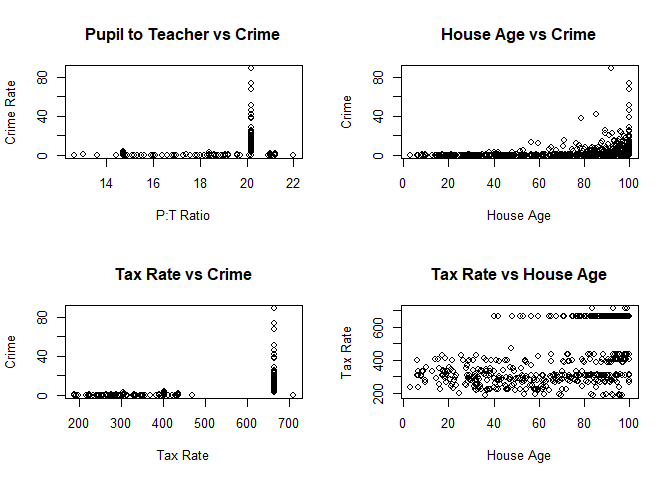
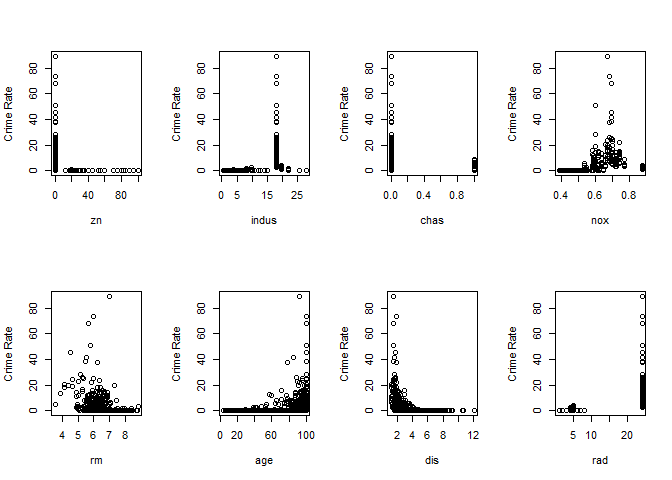
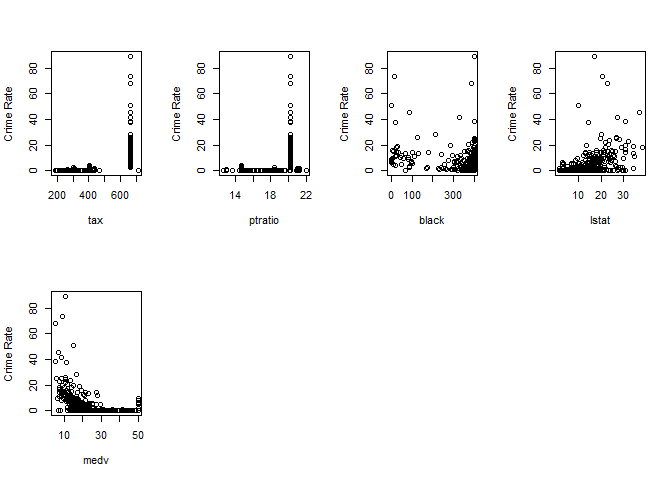
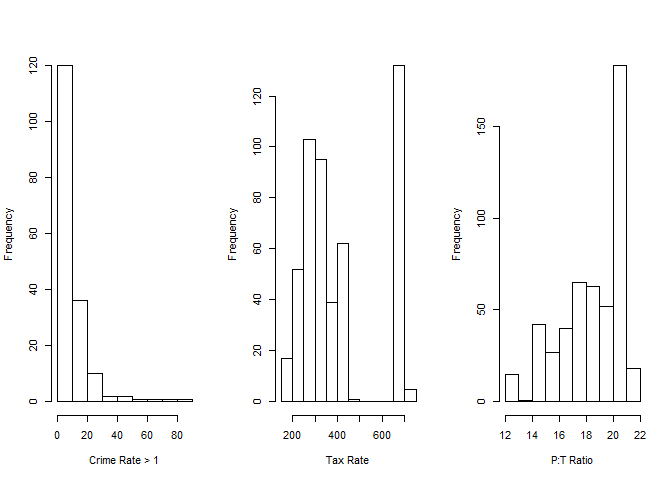

# Question 2.4.10


## Solution.

### Part (a)


```r
library(MASS)
# Boston
# ?Boston
# Commenting out the above two commands because > Boston just shows too much data for the output, and > ?Boston opens a different window for the Boston documentation. Could show head(Boston) but no real need for this answer.
```
This dataset has 506 rows and 14 columns. Each row represents a different housing value, perhaps housing values of areas. 


### Part (b)


```r
par(mfrow=c(2,2))

plot(Boston$ptratio, Boston$crim, main="Pupil to Teacher vs Crime", xlab="P:T Ratio", ylab="Crime Rate")

plot(Boston$age, Boston$crim, main="House Age vs Crime", xlab="House Age", ylab="Crime")

plot(Boston$tax, Boston$crim, main="Tax Rate vs Crime", xlab="Tax Rate", ylab="Crime")

plot(Boston$age, Boston$tax, main="Tax Rate vs House Age", xlab="House Age", ylab="Tax Rate")
```

<!-- -->

Looking at these four graphs, we can see some decent results.

First, the crime rate seems to increase at the roughly 20 students per teacher ratio, as the crime rate very clearly spikes at that area. Lower student to teacher ratios show hardly any crime happening.

Next, it seems clear that as the houses get older, their crime rate increases consistently. This means that crimes happen more often in older neighborhoods.

We also check tax rate against crime rate, and see that higher tax rates seem to have higher crime rates as well, almost all around the 675 tax rate mark. 

This made me want to check tax rate against house age as well, since we saw older housing had higher crime rates, and higher tax rates usually had higher crime rates as well. However, looking at tax rate vs house age, we see a large variety of points on the lower half of tax rate throughout *all* sorts of housing ages, with a heavier amount on the older houses. Though, when you look at the highest points of Tax Rate, we see the older houses being heavily shown in that area, with none of the houses within 40 years of age being shown at the high end of taxes.

### Part (c)

```r
par(mfrow=c(2,4))

# Starting at 2 to skip the initial predictor which results in Crime Rate vs Crime Rate

for(c in 2:ncol(Boston))
{
  plot(Boston[,c], Boston$crim, xlab=colnames(Boston[c]), ylab="Crime Rate")
}
```

<!-- --><!-- -->

There seem to be some clear relationships between crime rate and other predictors from the graphs above: 

* #### House Age
    + The older the house is, the higher the crime rate.

* #### Distance to Employment Centres
    + The lower the distance, the higher the crime rate.
    
* #### Pupil-to-Teacher Ratio
    + Smaller numbers of students per teacher seem to have lower crime rates.
    
* #### Black
    + Looks as if areas that are more black-dominant have higher crime rates.
    
* #### Median House Value
    + The less a house costs, the more crime seems to happen. This is slightly consistent with house age, as older houses tend to cost less.

### Part (d)

Looking at Boston$crim with fix(data), we see a significant amount of suburbs with crime rates below 1.


```r
# produce 3 histograms
par(mfrow=c(1,3))

hist(Boston$crim[Boston$crim > 1], main="", xlab="Crime Rate > 1")

hist(Boston$tax, main="", xlab="Tax Rate")

hist(Boston$ptratio, main="", xlab="P:T Ratio")
```

<!-- -->

#### Findings

* High Crime Rates seem to be more frequent in a small amount of areas.

* There seems to be a large gap in tax rates between the low end and high end, with the peak being in the high end.

* A higher Pupil to Teacher Ratio is more frequent, with the peak being the same area where crime and P:T Ratio's relationship peaks as well.

### Part (e)


```r
length(which(Boston$chas == 1))
```

```
## [1] 35
```

So there are 35 suburbs in this data set that bound the Charles River.

### Part (f)


```r
median(Boston$ptratio)
```

```
## [1] 19.05
```

The median pupil to teacher ratio in this data set is 19.05.

### Part (g)


```r
Boston[which(Boston$medv == min(Boston$medv)),]
```

```
##        crim zn indus chas   nox    rm age    dis rad tax ptratio  black
## 399 38.3518  0  18.1    0 0.693 5.453 100 1.4896  24 666    20.2 396.90
## 406 67.9208  0  18.1    0 0.693 5.683 100 1.4254  24 666    20.2 384.97
##     lstat medv
## 399 30.59    5
## 406 22.98    5
```

```r
# Not sure how to print the mean of each predictor in one line without a different library and I'm not sure if we can use any others than as instructed. Using summary(Boston) could work but looks a bit messier to me. Still a good option though, I just wanted to mess around a bit.

for(c in 1:ncol(Boston))
{
    cat(sprintf("Mean of %s: %f\n", colnames(Boston[c]), mean(Boston[,c], na.rm=T)))
}
```

```
## Mean of crim: 3.613524
## Mean of zn: 11.363636
## Mean of indus: 11.136779
## Mean of chas: 0.069170
## Mean of nox: 0.554695
## Mean of rm: 6.284634
## Mean of age: 68.574901
## Mean of dis: 3.795043
## Mean of rad: 9.549407
## Mean of tax: 408.237154
## Mean of ptratio: 18.455534
## Mean of black: 356.674032
## Mean of lstat: 12.653063
## Mean of medv: 22.532806
```

As we can see from the outputs above, the crime rates in these areas are decently high and the houses are on the extreme end of age. These houses are below the mean distance to employment centres as well. Crime rate may be high but there are some decent factors such as the low prices. I wouldn't choose to live here though.

### Part (h)


```r
length(which(Boston$rm > 7))
```

```
## [1] 64
```

```r
length(which(Boston$rm > 8))
```

```
## [1] 13
```

There are 64 suburbs of Boston with more than 7 rooms per dwelling, and 13 suburbs with more than 8 rooms per dwelling.


```r
Boston[which(Boston$rm > 8),]
```

```
##        crim zn indus chas    nox    rm  age    dis rad tax ptratio  black
## 98  0.12083  0  2.89    0 0.4450 8.069 76.0 3.4952   2 276    18.0 396.90
## 164 1.51902  0 19.58    1 0.6050 8.375 93.9 2.1620   5 403    14.7 388.45
## 205 0.02009 95  2.68    0 0.4161 8.034 31.9 5.1180   4 224    14.7 390.55
## 225 0.31533  0  6.20    0 0.5040 8.266 78.3 2.8944   8 307    17.4 385.05
## 226 0.52693  0  6.20    0 0.5040 8.725 83.0 2.8944   8 307    17.4 382.00
## 227 0.38214  0  6.20    0 0.5040 8.040 86.5 3.2157   8 307    17.4 387.38
## 233 0.57529  0  6.20    0 0.5070 8.337 73.3 3.8384   8 307    17.4 385.91
## 234 0.33147  0  6.20    0 0.5070 8.247 70.4 3.6519   8 307    17.4 378.95
## 254 0.36894 22  5.86    0 0.4310 8.259  8.4 8.9067   7 330    19.1 396.90
## 258 0.61154 20  3.97    0 0.6470 8.704 86.9 1.8010   5 264    13.0 389.70
## 263 0.52014 20  3.97    0 0.6470 8.398 91.5 2.2885   5 264    13.0 386.86
## 268 0.57834 20  3.97    0 0.5750 8.297 67.0 2.4216   5 264    13.0 384.54
## 365 3.47428  0 18.10    1 0.7180 8.780 82.9 1.9047  24 666    20.2 354.55
##     lstat medv
## 98   4.21 38.7
## 164  3.32 50.0
## 205  2.88 50.0
## 225  4.14 44.8
## 226  4.63 50.0
## 227  3.13 37.6
## 233  2.47 41.7
## 234  3.95 48.3
## 254  3.54 42.8
## 258  5.12 50.0
## 263  5.91 48.8
## 268  7.44 50.0
## 365  5.29 21.9
```

```r
# Using summary for comparison this time just to see how both go.
summary(Boston)
```

```
##       crim                zn             indus            chas        
##  Min.   : 0.00632   Min.   :  0.00   Min.   : 0.46   Min.   :0.00000  
##  1st Qu.: 0.08204   1st Qu.:  0.00   1st Qu.: 5.19   1st Qu.:0.00000  
##  Median : 0.25651   Median :  0.00   Median : 9.69   Median :0.00000  
##  Mean   : 3.61352   Mean   : 11.36   Mean   :11.14   Mean   :0.06917  
##  3rd Qu.: 3.67708   3rd Qu.: 12.50   3rd Qu.:18.10   3rd Qu.:0.00000  
##  Max.   :88.97620   Max.   :100.00   Max.   :27.74   Max.   :1.00000  
##       nox               rm             age              dis        
##  Min.   :0.3850   Min.   :3.561   Min.   :  2.90   Min.   : 1.130  
##  1st Qu.:0.4490   1st Qu.:5.886   1st Qu.: 45.02   1st Qu.: 2.100  
##  Median :0.5380   Median :6.208   Median : 77.50   Median : 3.207  
##  Mean   :0.5547   Mean   :6.285   Mean   : 68.57   Mean   : 3.795  
##  3rd Qu.:0.6240   3rd Qu.:6.623   3rd Qu.: 94.08   3rd Qu.: 5.188  
##  Max.   :0.8710   Max.   :8.780   Max.   :100.00   Max.   :12.127  
##       rad              tax           ptratio          black       
##  Min.   : 1.000   Min.   :187.0   Min.   :12.60   Min.   :  0.32  
##  1st Qu.: 4.000   1st Qu.:279.0   1st Qu.:17.40   1st Qu.:375.38  
##  Median : 5.000   Median :330.0   Median :19.05   Median :391.44  
##  Mean   : 9.549   Mean   :408.2   Mean   :18.46   Mean   :356.67  
##  3rd Qu.:24.000   3rd Qu.:666.0   3rd Qu.:20.20   3rd Qu.:396.23  
##  Max.   :24.000   Max.   :711.0   Max.   :22.00   Max.   :396.90  
##      lstat            medv      
##  Min.   : 1.73   Min.   : 5.00  
##  1st Qu.: 6.95   1st Qu.:17.02  
##  Median :11.36   Median :21.20  
##  Mean   :12.65   Mean   :22.53  
##  3rd Qu.:16.95   3rd Qu.:25.00  
##  Max.   :37.97   Max.   :50.00
```

Without aggregating the means of each column again and just glancing at this small subset, we can see that the crime rate of the 13 suburbs is lower than average by a good chunk(aside from the last suburb being slightly lower). 

None of these suburbs reach the 9 room per dwelling mark, and the last suburb of this subset seems to have some outlier data entries among the other 12: 

* Tax rate much higher

* Nitrogen oxides concentrations are much higher

* Significantly larger index of accessibility to radial highways

* One of the two clearly industrial areas 

* Has the lowest median house value of the 13 suburbs of interest

* Far higher crimerate than the others in this subset
