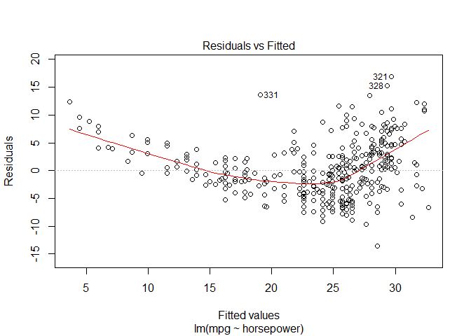
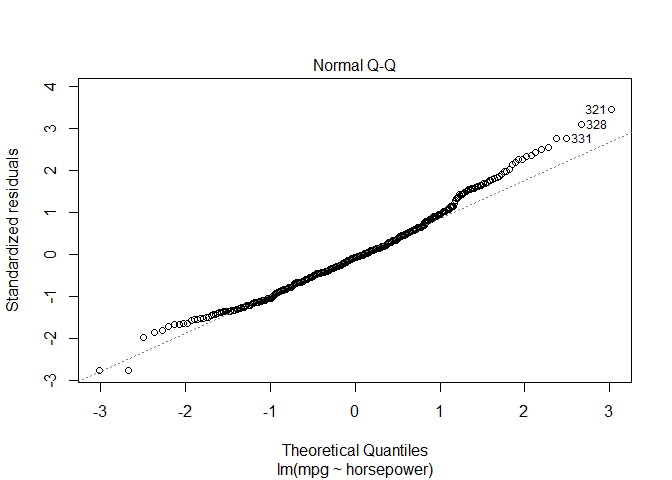
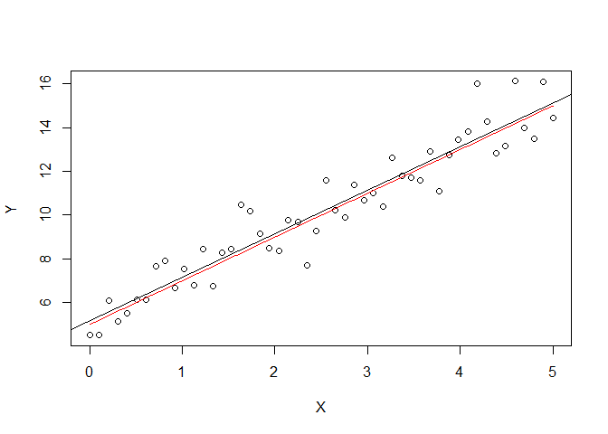

# Question 4 ISLR 3.4.8


## Solution.

### Part (a)


```r
library(ISLR)
```

```
## Warning: package 'ISLR' was built under R version 3.4.4
```

```r
attach(Auto) # Allows us to just use mpg, horsepower, etc without specifying the dataset.
auto.lm <- lm(mpg ~ horsepower)
summary(auto.lm)
```

```
## 
## Call:
## lm(formula = mpg ~ horsepower)
## 
## Residuals:
##      Min       1Q   Median       3Q      Max 
## -13.5710  -3.2592  -0.3435   2.7630  16.9240 
## 
## Coefficients:
##              Estimate Std. Error t value Pr(>|t|)    
## (Intercept) 39.935861   0.717499   55.66   <2e-16 ***
## horsepower  -0.157845   0.006446  -24.49   <2e-16 ***
## ---
## Signif. codes:  0 '***' 0.001 '**' 0.01 '*' 0.05 '.' 0.1 ' ' 1
## 
## Residual standard error: 4.906 on 390 degrees of freedom
## Multiple R-squared:  0.6059,	Adjusted R-squared:  0.6049 
## F-statistic: 599.7 on 1 and 390 DF,  p-value: < 2.2e-16
```

#### (i)
There seems to be a significant relationship based on the p-values, yes. 

#### (ii)
Not sure how to word this, but the relationship seems strong since the multiple $R^2$ is saying ~60.6% of the variance in mpg is explained by horsepower.

#### (iii)
The relationship is negative, as can be seen by $\hat{\beta}_1$.

#### (iv)
I think we should be using predict() here? This is similar to what the book shows at least.


```r
predict(auto.lm, data.frame(horsepower=98), interval="confidence")
```

```
##        fit      lwr      upr
## 1 24.46708 23.97308 24.96108
```

```r
predict(auto.lm, data.frame(horsepower=98), interval="prediction")
```

```
##        fit     lwr      upr
## 1 24.46708 14.8094 34.12476
```
This shows the predicted mpg associated with a horsepower of 98 is 24.467. 
### Part (b)


```r
plot(horsepower, mpg)
abline(auto.lm)
```

<!-- -->


### Part (c)


```r
plot(auto.lm)
```

<!-- --><!-- --><!-- --><!-- -->

Similar to the example in the book, we can see that from the residuals vs fitted plot alone there may be some non-linearity.


# Question 5


## Solution.

### Part (a)


```r
# Mean 0 and variance 1 by default.
epsilon <- rnorm(50)
```


### Part (b)


```r
X <- seq(from=0, to=5, length.out=50)
```


### Part (c)


```r
Y <- 5 + 2*X + epsilon
```


### Part (d)


```r
model.lm <- lm(Y~X)
model.lm
```

```
## 
## Call:
## lm(formula = Y ~ X)
## 
## Coefficients:
## (Intercept)            X  
##       5.001        1.989
```

The coefficients are very close to the true model which has $\beta_0$ = 5 and $\beta_1$ = 2.


```r
plot(X, Y)
abline(model.lm)
x <- seq(0, 5, by=0.01)
f <- 5+2*x
lines(x, f, col="red")
```

<!-- -->

The red line represents the true model, f(x) = 5+2x.

### Part (e)


```r
epsilon <- rnorm(50)
X <- seq(from=0, to=5, length.out=50)
Y <- 5 + 2*X + epsilon
model.lm <- lm(Y~X)
model.lm
```

```
## 
## Call:
## lm(formula = Y ~ X)
## 
## Coefficients:
## (Intercept)            X  
##       5.152        1.996
```

```r
plot(X, Y)
abline(model.lm)
x <- seq(0, 5, by=0.01)
f <- 5+2*x
lines(x, f, col="red")
```

<!-- -->

The coefficients of our model are still very close to the true model, with a bit of a difference each time this is ran. 

### Part (f)


```r
epsilon <- rnorm(50, 0, 9)
X <- seq(from=0, to=5, length.out=50)
Y <- 5 + 2*X + epsilon
model.lm <- lm(Y~X)
model.lm
```

```
## 
## Call:
## lm(formula = Y ~ X)
## 
## Coefficients:
## (Intercept)            X  
##       5.380        1.899
```

```r
plot(X, Y)
abline(model.lm)
x <- seq(0, 5, by=0.01)
f <- 5+2*x
lines(x, f, col="red")
```

<!-- -->

After running this multiple times I saw different results ranging from parallel lines to identical lines. The slope and intercept both varied from run to run by decent margins. This clearly should happen because the variance in our randomly generated error terms has a higher variance so the results will be less consistent with the true line. 
