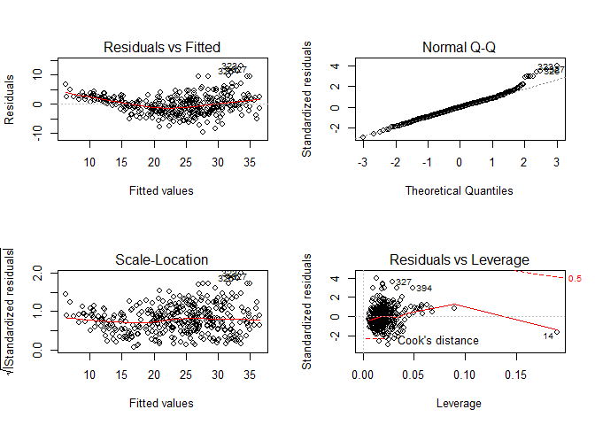
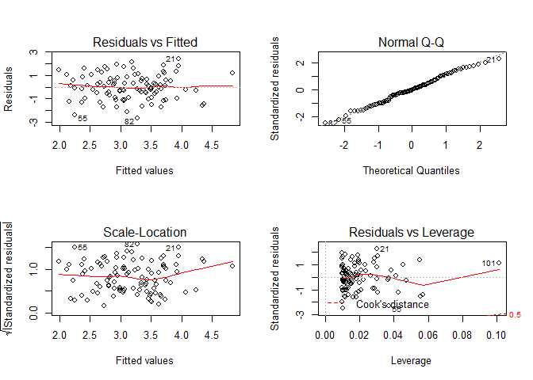

# Question 2 ISLR 3.7.9


## Solution.

### Part (a)


```r
library(ISLR)
```

```
## Warning: package 'ISLR' was built under R version 3.4.4
```

```r
library(MASS) # for studres()
plot(Auto)
```

<!-- -->

### Part (b)

```r
cor(subset(Auto, select = -name))
```

```
##                     mpg  cylinders displacement horsepower     weight
## mpg           1.0000000 -0.7776175   -0.8051269 -0.7784268 -0.8322442
## cylinders    -0.7776175  1.0000000    0.9508233  0.8429834  0.8975273
## displacement -0.8051269  0.9508233    1.0000000  0.8972570  0.9329944
## horsepower   -0.7784268  0.8429834    0.8972570  1.0000000  0.8645377
## weight       -0.8322442  0.8975273    0.9329944  0.8645377  1.0000000
## acceleration  0.4233285 -0.5046834   -0.5438005 -0.6891955 -0.4168392
## year          0.5805410 -0.3456474   -0.3698552 -0.4163615 -0.3091199
## origin        0.5652088 -0.5689316   -0.6145351 -0.4551715 -0.5850054
##              acceleration       year     origin
## mpg             0.4233285  0.5805410  0.5652088
## cylinders      -0.5046834 -0.3456474 -0.5689316
## displacement   -0.5438005 -0.3698552 -0.6145351
## horsepower     -0.6891955 -0.4163615 -0.4551715
## weight         -0.4168392 -0.3091199 -0.5850054
## acceleration    1.0000000  0.2903161  0.2127458
## year            0.2903161  1.0000000  0.1815277
## origin          0.2127458  0.1815277  1.0000000
```

### Part (c)

```r
summary(lm(mpg ~ .-name, data=Auto))
```

```
## 
## Call:
## lm(formula = mpg ~ . - name, data = Auto)
## 
## Residuals:
##     Min      1Q  Median      3Q     Max 
## -9.5903 -2.1565 -0.1169  1.8690 13.0604 
## 
## Coefficients:
##                Estimate Std. Error t value Pr(>|t|)    
## (Intercept)  -17.218435   4.644294  -3.707  0.00024 ***
## cylinders     -0.493376   0.323282  -1.526  0.12780    
## displacement   0.019896   0.007515   2.647  0.00844 ** 
## horsepower    -0.016951   0.013787  -1.230  0.21963    
## weight        -0.006474   0.000652  -9.929  < 2e-16 ***
## acceleration   0.080576   0.098845   0.815  0.41548    
## year           0.750773   0.050973  14.729  < 2e-16 ***
## origin         1.426141   0.278136   5.127 4.67e-07 ***
## ---
## Signif. codes:  0 '***' 0.001 '**' 0.01 '*' 0.05 '.' 0.1 ' ' 1
## 
## Residual standard error: 3.328 on 384 degrees of freedom
## Multiple R-squared:  0.8215,	Adjusted R-squared:  0.8182 
## F-statistic: 252.4 on 7 and 384 DF,  p-value: < 2.2e-16
```

#### Part (i)
There is definitely a relationship between the predictors and *mpg* which can be seen by the F-statistic and it's corresponding p-value, as well as how close the $R^2$ value is to 1. 

#### Part (ii)
Just by looking at the p-values we can see that all of the predictors are statistically significant except for **cylinders, horsepower, and acceleration**.

#### Part (iii)
This positive coefficient for *year* indicates that each year the mpg increases by ~0.75, so each year cars are becoming slightly more fuel efficient.

### Part (d)

```r
par(mfrow = c(2,2))
plot(lm(mpg ~ .-name, data=Auto))
```

<!-- -->

```r
par(mfrow = c(1,1))
plot(studres(lm(mpg ~ .-name, data=Auto)))
```

<!-- -->

The fit doesn't seem to be very accurate because there is a pattern to the residuals plot which may be quadratic. The Residuals vs Leverage plot seems to show some points with high leverage(or low, rather) like point 14. This point doesn't seem to be an outlier though based on the studres plot, whereas the outliers below Cook's Distance range don't seem to have high leverage, so they aren't very dangerous. 

Based on the studres() plot however, we can see some outliers above $t_i = 3$ and maybe below $t_i = -3$, so let's check:


```r
which(studres(lm(mpg ~ .-name, data=Auto)) >= 3)
```

```
## 245 323 326 327 
## 243 321 324 325
```

```r
which(studres(lm(mpg ~ .-name, data=Auto)) <= -3)
```

```
## named integer(0)
```

From this, we can see there are actually no points below $t_i = -3$ but there are quite a few above $t_i = 3$. Those entries above are the outliers.

### Part (e)

```r
summary(lm(mpg ~ .*. -name*.+.-name, data=Auto))
```

```
## 
## Call:
## lm(formula = mpg ~ . * . - name * . + . - name, data = Auto)
## 
## Residuals:
##     Min      1Q  Median      3Q     Max 
## -7.6303 -1.4481  0.0596  1.2739 11.1386 
## 
## Coefficients:
##                             Estimate Std. Error t value Pr(>|t|)   
## (Intercept)                3.548e+01  5.314e+01   0.668  0.50475   
## cylinders                  6.989e+00  8.248e+00   0.847  0.39738   
## displacement              -4.785e-01  1.894e-01  -2.527  0.01192 * 
## horsepower                 5.034e-01  3.470e-01   1.451  0.14769   
## weight                     4.133e-03  1.759e-02   0.235  0.81442   
## acceleration              -5.859e+00  2.174e+00  -2.696  0.00735 **
## year                       6.974e-01  6.097e-01   1.144  0.25340   
## origin                    -2.090e+01  7.097e+00  -2.944  0.00345 **
## cylinders:displacement    -3.383e-03  6.455e-03  -0.524  0.60051   
## cylinders:horsepower       1.161e-02  2.420e-02   0.480  0.63157   
## cylinders:weight           3.575e-04  8.955e-04   0.399  0.69000   
## cylinders:acceleration     2.779e-01  1.664e-01   1.670  0.09584 . 
## cylinders:year            -1.741e-01  9.714e-02  -1.793  0.07389 . 
## cylinders:origin           4.022e-01  4.926e-01   0.816  0.41482   
## displacement:horsepower   -8.491e-05  2.885e-04  -0.294  0.76867   
## displacement:weight        2.472e-05  1.470e-05   1.682  0.09342 . 
## displacement:acceleration -3.479e-03  3.342e-03  -1.041  0.29853   
## displacement:year          5.934e-03  2.391e-03   2.482  0.01352 * 
## displacement:origin        2.398e-02  1.947e-02   1.232  0.21875   
## horsepower:weight         -1.968e-05  2.924e-05  -0.673  0.50124   
## horsepower:acceleration   -7.213e-03  3.719e-03  -1.939  0.05325 . 
## horsepower:year           -5.838e-03  3.938e-03  -1.482  0.13916   
## horsepower:origin          2.233e-03  2.930e-02   0.076  0.93931   
## weight:acceleration        2.346e-04  2.289e-04   1.025  0.30596   
## weight:year               -2.245e-04  2.127e-04  -1.056  0.29182   
## weight:origin             -5.789e-04  1.591e-03  -0.364  0.71623   
## acceleration:year          5.562e-02  2.558e-02   2.174  0.03033 * 
## acceleration:origin        4.583e-01  1.567e-01   2.926  0.00365 **
## year:origin                1.393e-01  7.399e-02   1.882  0.06062 . 
## ---
## Signif. codes:  0 '***' 0.001 '**' 0.01 '*' 0.05 '.' 0.1 ' ' 1
## 
## Residual standard error: 2.695 on 363 degrees of freedom
## Multiple R-squared:  0.8893,	Adjusted R-squared:  0.8808 
## F-statistic: 104.2 on 28 and 363 DF,  p-value: < 2.2e-16
```

I think this way is correct? This tests all predictors and all combinations of interaction terms. Doing it like this gives a lot of interactions that are statistically insignificant. The significant ones are displacement:year, acceleration:year, and acceleration:origin.

### Part (f)

```r
par(mfrow = c(2,2))
plot(log(Auto$displacement), Auto$mpg)
plot(sqrt(Auto$displacement), Auto$mpg)
plot((Auto$displacement)^2, Auto$mpg)
```

<!-- -->


```r
par(mfrow = c(2,2))
plot(log(Auto$weight), Auto$mpg)
plot(sqrt(Auto$weight), Auto$mpg)
plot((Auto$weight)^2, Auto$mpg)
```

<!-- -->


# Question 3 ISLR 3.7.13


## Solution.

```r
#par(mfrow = c(1,1))
set.seed(1)
```

### Part (a)

```r
x <- rnorm(100)
```

### Part (b)

```r
eps <- rnorm(100, 0, .5) # 0.5 as sd because variance needs to be 0.25
```

### Part (c)

```r
y <- -1 + .5*x + eps
length(y)
```

```
## [1] 100
```

The length of the vector *y* is 100. $\beta_0 = -1$ and $\beta_1 = 0.5$.

### Part (d)

```r
plot(x, y)
```

<!-- -->

The relationship between x and y seems to be linear with a positive slope and some variance to it.

### Part (e)

```r
fit.lm <- lm(y ~ x)
summary(fit.lm)
```

```
## 
## Call:
## lm(formula = y ~ x)
## 
## Residuals:
##      Min       1Q   Median       3Q      Max 
## -0.93842 -0.30688 -0.06975  0.26970  1.17309 
## 
## Coefficients:
##             Estimate Std. Error t value Pr(>|t|)    
## (Intercept) -1.01885    0.04849 -21.010  < 2e-16 ***
## x            0.49947    0.05386   9.273 4.58e-15 ***
## ---
## Signif. codes:  0 '***' 0.001 '**' 0.01 '*' 0.05 '.' 0.1 ' ' 1
## 
## Residual standard error: 0.4814 on 98 degrees of freedom
## Multiple R-squared:  0.4674,	Adjusted R-squared:  0.4619 
## F-statistic: 85.99 on 1 and 98 DF,  p-value: 4.583e-15
```

The values of $\hat{\beta_0}$ and $\hat{\beta_1}$ are very close to the values of $\beta_0$ and $\beta_1$ from above. We also see the p-values of the two predictors in this model being extremely close to 0 so we can reject the null.

### Part (f)

```r
plot(x,y)
abline(fit.lm, col="blue")
abline(-1, 0.5, col="red")
legend("bottomright", c("Model Fit", "Pop. Regression"), col=c("blue", "red"), lwd=2)
```

<!-- -->

### Part (g)

```r
fit.lm2 <- lm(y ~ x + I(x^2))
summary(fit.lm2)
```

```
## 
## Call:
## lm(formula = y ~ x + I(x^2))
## 
## Residuals:
##      Min       1Q   Median       3Q      Max 
## -0.98252 -0.31270 -0.06441  0.29014  1.13500 
## 
## Coefficients:
##             Estimate Std. Error t value Pr(>|t|)    
## (Intercept) -0.97164    0.05883 -16.517  < 2e-16 ***
## x            0.50858    0.05399   9.420  2.4e-15 ***
## I(x^2)      -0.05946    0.04238  -1.403    0.164    
## ---
## Signif. codes:  0 '***' 0.001 '**' 0.01 '*' 0.05 '.' 0.1 ' ' 1
## 
## Residual standard error: 0.479 on 97 degrees of freedom
## Multiple R-squared:  0.4779,	Adjusted R-squared:  0.4672 
## F-statistic:  44.4 on 2 and 97 DF,  p-value: 2.038e-14
```

It's kind of weird. The model has increased I believe because of the $R^2$ being higher, but the p-value of the $x^2$ term suggests there isn't a relationship there. 

### Part (h)

```r
set.seed(1)
x <- rnorm(100)
eps <- rnorm(100, 0, .1)
y <- -1 + 0.5*x + eps

plot(x, y)
fit.lmh <- lm(y ~ x)
summary(fit.lmh)
```

```
## 
## Call:
## lm(formula = y ~ x)
## 
## Residuals:
##      Min       1Q   Median       3Q      Max 
## -0.18768 -0.06138 -0.01395  0.05394  0.23462 
## 
## Coefficients:
##              Estimate Std. Error t value Pr(>|t|)    
## (Intercept) -1.003769   0.009699  -103.5   <2e-16 ***
## x            0.499894   0.010773    46.4   <2e-16 ***
## ---
## Signif. codes:  0 '***' 0.001 '**' 0.01 '*' 0.05 '.' 0.1 ' ' 1
## 
## Residual standard error: 0.09628 on 98 degrees of freedom
## Multiple R-squared:  0.9565,	Adjusted R-squared:  0.956 
## F-statistic:  2153 on 1 and 98 DF,  p-value: < 2.2e-16
```

```r
abline(fit.lmh, col="blue")
abline(-1, 0.5, col="red")
legend("bottomright", c("Model Fit", "Pop. Regression"), col=c("blue", "red"), lwd=2)
```

<!-- -->

Since we have a lower variance in our $\epsilon$ term, the $R^2$ values increased considerably and that's to be expected. We can also see that the model fit and population regression lines are overlapping which is evidence of very little noise. 

### Part (i)

```r
set.seed(1)
x <- rnorm(100)
eps <- rnorm(100, 0, 5)
y <- -1 + 0.5*x + eps

plot(x, y)
fit.lmi <- lm(y ~ x)
summary(fit.lmi)
```

```
## 
## Call:
## lm(formula = y ~ x)
## 
## Residuals:
##     Min      1Q  Median      3Q     Max 
## -9.3842 -3.0688 -0.6975  2.6970 11.7309 
## 
## Coefficients:
##             Estimate Std. Error t value Pr(>|t|)  
## (Intercept)  -1.1885     0.4849  -2.451    0.016 *
## x             0.4947     0.5386   0.918    0.361  
## ---
## Signif. codes:  0 '***' 0.001 '**' 0.01 '*' 0.05 '.' 0.1 ' ' 1
## 
## Residual standard error: 4.814 on 98 degrees of freedom
## Multiple R-squared:  0.008534,	Adjusted R-squared:  -0.001583 
## F-statistic: 0.8435 on 1 and 98 DF,  p-value: 0.3606
```

```r
abline(fit.lmi, col="blue")
abline(-1, 0.5, col="red")
legend("bottomright", c("Model Fit", "Pop. Regression"), col=c("blue", "red"), lwd=2)
```

<!-- -->

As expected, this looks terrible. There is a ton of variance in $\epsilon$ making it hard to fit a line well. Just look at the $R^2$ value again and it's easy to see how poor it is with the value being so close to 0. One thing to also note however is that the two lines are still close together but their distance is more wide than previous models. 

### Part (j)
Original data set:

```r
confint(fit.lm)
```

```
##                  2.5 %     97.5 %
## (Intercept) -1.1150804 -0.9226122
## x            0.3925794  0.6063602
```

Less noisy data set:

```r
confint(fit.lmh)
```

```
##                  2.5 %     97.5 %
## (Intercept) -1.0230161 -0.9845224
## x            0.4785159  0.5212720
```

More noisy data set:

```r
confint(fit.lmi)
```

```
##                  2.5 %     97.5 %
## (Intercept) -2.1508037 -0.2261224
## x           -0.5742059  1.5636020
```

We can see that the noisiest data set has the widest intervals while the less noisy data set has the most narrow intervals. Another thing to see is that *all* of these models seem to have their x centered around 0.5.

# Question 4 ISLR 3.7.14


## Solution.

### Part (a)


```r
set.seed(1)
x1 <- runif(100)
x2 <- 0.5 * x1 + rnorm(100)/10
y <- 2 + 2*x1 + 0.3*x2 + rnorm(100)
```

The *form* of the linear model is $$Y = 2 + 2X_1 + 0.3X_2 + \epsilon$$

with $\epsilon$ ~ $N(0,1)$.

The regression coefficients are $\beta_0 = 2, \beta_1 = 2, \beta_3 = 0.3$.

### Part (b)
The correlation between $x_1$ and $x_2$ is:

```r
cor(x1, x2)
```

```
## [1] 0.8351212
```

```r
plot(x1, x2)
```

<!-- -->

### Part (c)

```r
fit.lm <- lm(y ~ x1 + x2)
summary(fit.lm)
```

```
## 
## Call:
## lm(formula = y ~ x1 + x2)
## 
## Residuals:
##     Min      1Q  Median      3Q     Max 
## -2.8311 -0.7273 -0.0537  0.6338  2.3359 
## 
## Coefficients:
##             Estimate Std. Error t value Pr(>|t|)    
## (Intercept)   2.1305     0.2319   9.188 7.61e-15 ***
## x1            1.4396     0.7212   1.996   0.0487 *  
## x2            1.0097     1.1337   0.891   0.3754    
## ---
## Signif. codes:  0 '***' 0.001 '**' 0.01 '*' 0.05 '.' 0.1 ' ' 1
## 
## Residual standard error: 1.056 on 97 degrees of freedom
## Multiple R-squared:  0.2088,	Adjusted R-squared:  0.1925 
## F-statistic:  12.8 on 2 and 97 DF,  p-value: 1.164e-05
```

$\hat{\beta_0} = 2.13, \hat{\beta_1} = 1.44, \hat{\beta_2} = 1.01$

Of these values, only $\hat{\beta_0}$ is close to it's corresponding $\beta$ value, $\beta_0$. The p-value for $\hat{\beta_1}$ is slightly less than 0.5, so we may reject the null for this value. But the value for $\hat{\beta_2}$ is high enough to fail rejection of the null in that case. 

### Part (d)

```r
fit.lmd <- lm(y ~ x1)
summary(fit.lmd)
```

```
## 
## Call:
## lm(formula = y ~ x1)
## 
## Residuals:
##      Min       1Q   Median       3Q      Max 
## -2.89495 -0.66874 -0.07785  0.59221  2.45560 
## 
## Coefficients:
##             Estimate Std. Error t value Pr(>|t|)    
## (Intercept)   2.1124     0.2307   9.155 8.27e-15 ***
## x1            1.9759     0.3963   4.986 2.66e-06 ***
## ---
## Signif. codes:  0 '***' 0.001 '**' 0.01 '*' 0.05 '.' 0.1 ' ' 1
## 
## Residual standard error: 1.055 on 98 degrees of freedom
## Multiple R-squared:  0.2024,	Adjusted R-squared:  0.1942 
## F-statistic: 24.86 on 1 and 98 DF,  p-value: 2.661e-06
```

The p-value here for $\hat{\beta_1}$ is extremely small so we can reject the null, this is quite different from the $\hat{\beta_1}$ value when we used the model with both $\hat{\beta_1}, \hat{\beta_2}$ as the predictors. 

### Part (e)

```r
fit.lme <- lm(y ~ x2)
summary(fit.lme)
```

```
## 
## Call:
## lm(formula = y ~ x2)
## 
## Residuals:
##      Min       1Q   Median       3Q      Max 
## -2.62687 -0.75156 -0.03598  0.72383  2.44890 
## 
## Coefficients:
##             Estimate Std. Error t value Pr(>|t|)    
## (Intercept)   2.3899     0.1949   12.26  < 2e-16 ***
## x2            2.8996     0.6330    4.58 1.37e-05 ***
## ---
## Signif. codes:  0 '***' 0.001 '**' 0.01 '*' 0.05 '.' 0.1 ' ' 1
## 
## Residual standard error: 1.072 on 98 degrees of freedom
## Multiple R-squared:  0.1763,	Adjusted R-squared:  0.1679 
## F-statistic: 20.98 on 1 and 98 DF,  p-value: 1.366e-05
```

Again we can reject the null safely here as the p-value is so small, so $\hat{\beta_2}$ is very significant. Similar to the last problem, this is far different from the model that was using both predictors.

### Part (f)
The results are not contradictory because $\hat{\beta_1}, \hat{\beta_2}$ have very high correlation(could we say they're collinear? I think so), so it is hard to distinguish their effects when they are used for regression in tandem because they share so much information. However, as we saw in the previous parts, when we use them for regression separately the relationship between each individual predictor and y is more clear and each is significant.

### Part (g)

```r
x1 <- c(x1, 0.1)
x2 <- c(x2, 0.8)
y <- c(y, 6)

cor(x1, x2)
```

```
## [1] 0.7392279
```

```r
fit.lmg1 <- lm(y ~ x1 + x2)
summary(fit.lmg1)
```

```
## 
## Call:
## lm(formula = y ~ x1 + x2)
## 
## Residuals:
##      Min       1Q   Median       3Q      Max 
## -2.73348 -0.69318 -0.05263  0.66385  2.30619 
## 
## Coefficients:
##             Estimate Std. Error t value Pr(>|t|)    
## (Intercept)   2.2267     0.2314   9.624 7.91e-16 ***
## x1            0.5394     0.5922   0.911  0.36458    
## x2            2.5146     0.8977   2.801  0.00614 ** 
## ---
## Signif. codes:  0 '***' 0.001 '**' 0.01 '*' 0.05 '.' 0.1 ' ' 1
## 
## Residual standard error: 1.075 on 98 degrees of freedom
## Multiple R-squared:  0.2188,	Adjusted R-squared:  0.2029 
## F-statistic: 13.72 on 2 and 98 DF,  p-value: 5.564e-06
```

```r
fit.lmg2 <- lm(y ~ x1)
summary(fit.lmg2)
```

```
## 
## Call:
## lm(formula = y ~ x1)
## 
## Residuals:
##     Min      1Q  Median      3Q     Max 
## -2.8897 -0.6556 -0.0909  0.5682  3.5665 
## 
## Coefficients:
##             Estimate Std. Error t value Pr(>|t|)    
## (Intercept)   2.2569     0.2390   9.445 1.78e-15 ***
## x1            1.7657     0.4124   4.282 4.29e-05 ***
## ---
## Signif. codes:  0 '***' 0.001 '**' 0.01 '*' 0.05 '.' 0.1 ' ' 1
## 
## Residual standard error: 1.111 on 99 degrees of freedom
## Multiple R-squared:  0.1562,	Adjusted R-squared:  0.1477 
## F-statistic: 18.33 on 1 and 99 DF,  p-value: 4.295e-05
```

```r
fit.lmg3 <- lm(y ~ x2)
summary(fit.lmg3)
```

```
## 
## Call:
## lm(formula = y ~ x2)
## 
## Residuals:
##      Min       1Q   Median       3Q      Max 
## -2.64729 -0.71021 -0.06899  0.72699  2.38074 
## 
## Coefficients:
##             Estimate Std. Error t value Pr(>|t|)    
## (Intercept)   2.3451     0.1912  12.264  < 2e-16 ***
## x2            3.1190     0.6040   5.164 1.25e-06 ***
## ---
## Signif. codes:  0 '***' 0.001 '**' 0.01 '*' 0.05 '.' 0.1 ' ' 1
## 
## Residual standard error: 1.074 on 99 degrees of freedom
## Multiple R-squared:  0.2122,	Adjusted R-squared:  0.2042 
## F-statistic: 26.66 on 1 and 99 DF,  p-value: 1.253e-06
```

```r
par(mfrow = c(2,2))
plot(fit.lmg1)
```

<!-- -->

```r
plot(fit.lmg2)
```

<!-- -->

```r
plot(fit.lmg3)
```

<!-- -->

```r
plot(studres(fit.lmg1))
plot(studres(fit.lmg2))
plot(studres(fit.lmg3))
```

<!-- -->


```r
which(studres(fit.lmg1) >= 3)
```

```
## named integer(0)
```

```r
which(studres(fit.lmg1) <= -3)
```

```
## named integer(0)
```

```r
which(studres(fit.lmg2) >= 3)
```

```
## 101 
## 101
```

```r
which(studres(fit.lmg2) <= -3)
```

```
## named integer(0)
```

```r
which(studres(fit.lmg3) >= 3)
```

```
## named integer(0)
```

```r
which(studres(fit.lmg3) <= -3)
```

```
## named integer(0)
```

In the model with both predictors we can see $\hat{\beta_1}$ becoming insignificant and $\hat{\beta_2}$ becoming significant which is the opposite of when we used both predictors in the previous model before adding in the new values(reference part **c**). The correlation between $\hat{\beta_1}$ and $\hat{\beta_2}$ is still somewhat high, but definitely lower than before so the "swapping" of the significances in the model with both predictors shouldn't be a huge deal.

Only the model using $\hat{\beta_1}$ as a predictor has an outlier based on the studres values. This outlier isn't necessarily a high leverage point for this specific model based on the Leverage plot, but in the other two models it is most definitely a high leverage point, yet it is not an outlier.

# Question 5 ISLR 3.7.15


## Solution.

### Part (a)


```r
library(MASS)
```


```r
zone.fit <- lm(crim ~ zn, data=Boston)
summary(zone.fit)
```

```
## 
## Call:
## lm(formula = crim ~ zn, data = Boston)
## 
## Residuals:
##    Min     1Q Median     3Q    Max 
## -4.429 -4.222 -2.620  1.250 84.523 
## 
## Coefficients:
##             Estimate Std. Error t value Pr(>|t|)    
## (Intercept)  4.45369    0.41722  10.675  < 2e-16 ***
## zn          -0.07393    0.01609  -4.594 5.51e-06 ***
## ---
## Signif. codes:  0 '***' 0.001 '**' 0.01 '*' 0.05 '.' 0.1 ' ' 1
## 
## Residual standard error: 8.435 on 504 degrees of freedom
## Multiple R-squared:  0.04019,	Adjusted R-squared:  0.03828 
## F-statistic:  21.1 on 1 and 504 DF,  p-value: 5.506e-06
```

```r
indus.fit <- lm(crim ~ indus, data=Boston)
summary(indus.fit)
```

```
## 
## Call:
## lm(formula = crim ~ indus, data = Boston)
## 
## Residuals:
##     Min      1Q  Median      3Q     Max 
## -11.972  -2.698  -0.736   0.712  81.813 
## 
## Coefficients:
##             Estimate Std. Error t value Pr(>|t|)    
## (Intercept) -2.06374    0.66723  -3.093  0.00209 ** 
## indus        0.50978    0.05102   9.991  < 2e-16 ***
## ---
## Signif. codes:  0 '***' 0.001 '**' 0.01 '*' 0.05 '.' 0.1 ' ' 1
## 
## Residual standard error: 7.866 on 504 degrees of freedom
## Multiple R-squared:  0.1653,	Adjusted R-squared:  0.1637 
## F-statistic: 99.82 on 1 and 504 DF,  p-value: < 2.2e-16
```

```r
chas.fit <- lm(crim ~ chas, data=Boston)
summary(chas.fit)
```

```
## 
## Call:
## lm(formula = crim ~ chas, data = Boston)
## 
## Residuals:
##    Min     1Q Median     3Q    Max 
## -3.738 -3.661 -3.435  0.018 85.232 
## 
## Coefficients:
##             Estimate Std. Error t value Pr(>|t|)    
## (Intercept)   3.7444     0.3961   9.453   <2e-16 ***
## chas         -1.8928     1.5061  -1.257    0.209    
## ---
## Signif. codes:  0 '***' 0.001 '**' 0.01 '*' 0.05 '.' 0.1 ' ' 1
## 
## Residual standard error: 8.597 on 504 degrees of freedom
## Multiple R-squared:  0.003124,	Adjusted R-squared:  0.001146 
## F-statistic: 1.579 on 1 and 504 DF,  p-value: 0.2094
```

```r
nox.fit <- lm(crim ~ nox, data=Boston)
summary(nox.fit)
```

```
## 
## Call:
## lm(formula = crim ~ nox, data = Boston)
## 
## Residuals:
##     Min      1Q  Median      3Q     Max 
## -12.371  -2.738  -0.974   0.559  81.728 
## 
## Coefficients:
##             Estimate Std. Error t value Pr(>|t|)    
## (Intercept)  -13.720      1.699  -8.073 5.08e-15 ***
## nox           31.249      2.999  10.419  < 2e-16 ***
## ---
## Signif. codes:  0 '***' 0.001 '**' 0.01 '*' 0.05 '.' 0.1 ' ' 1
## 
## Residual standard error: 7.81 on 504 degrees of freedom
## Multiple R-squared:  0.1772,	Adjusted R-squared:  0.1756 
## F-statistic: 108.6 on 1 and 504 DF,  p-value: < 2.2e-16
```

```r
rm.fit <- lm(crim ~ rm, data=Boston)
summary(rm.fit)
```

```
## 
## Call:
## lm(formula = crim ~ rm, data = Boston)
## 
## Residuals:
##    Min     1Q Median     3Q    Max 
## -6.604 -3.952 -2.654  0.989 87.197 
## 
## Coefficients:
##             Estimate Std. Error t value Pr(>|t|)    
## (Intercept)   20.482      3.365   6.088 2.27e-09 ***
## rm            -2.684      0.532  -5.045 6.35e-07 ***
## ---
## Signif. codes:  0 '***' 0.001 '**' 0.01 '*' 0.05 '.' 0.1 ' ' 1
## 
## Residual standard error: 8.401 on 504 degrees of freedom
## Multiple R-squared:  0.04807,	Adjusted R-squared:  0.04618 
## F-statistic: 25.45 on 1 and 504 DF,  p-value: 6.347e-07
```

```r
age.fit <- lm(crim ~ age, data=Boston)
summary(age.fit)
```

```
## 
## Call:
## lm(formula = crim ~ age, data = Boston)
## 
## Residuals:
##    Min     1Q Median     3Q    Max 
## -6.789 -4.257 -1.230  1.527 82.849 
## 
## Coefficients:
##             Estimate Std. Error t value Pr(>|t|)    
## (Intercept) -3.77791    0.94398  -4.002 7.22e-05 ***
## age          0.10779    0.01274   8.463 2.85e-16 ***
## ---
## Signif. codes:  0 '***' 0.001 '**' 0.01 '*' 0.05 '.' 0.1 ' ' 1
## 
## Residual standard error: 8.057 on 504 degrees of freedom
## Multiple R-squared:  0.1244,	Adjusted R-squared:  0.1227 
## F-statistic: 71.62 on 1 and 504 DF,  p-value: 2.855e-16
```

```r
dis.fit <- lm(crim ~ dis, data=Boston)
summary(dis.fit)
```

```
## 
## Call:
## lm(formula = crim ~ dis, data = Boston)
## 
## Residuals:
##    Min     1Q Median     3Q    Max 
## -6.708 -4.134 -1.527  1.516 81.674 
## 
## Coefficients:
##             Estimate Std. Error t value Pr(>|t|)    
## (Intercept)   9.4993     0.7304  13.006   <2e-16 ***
## dis          -1.5509     0.1683  -9.213   <2e-16 ***
## ---
## Signif. codes:  0 '***' 0.001 '**' 0.01 '*' 0.05 '.' 0.1 ' ' 1
## 
## Residual standard error: 7.965 on 504 degrees of freedom
## Multiple R-squared:  0.1441,	Adjusted R-squared:  0.1425 
## F-statistic: 84.89 on 1 and 504 DF,  p-value: < 2.2e-16
```

```r
rad.fit <- lm(crim ~ rad, data=Boston)
summary(rad.fit)
```

```
## 
## Call:
## lm(formula = crim ~ rad, data = Boston)
## 
## Residuals:
##     Min      1Q  Median      3Q     Max 
## -10.164  -1.381  -0.141   0.660  76.433 
## 
## Coefficients:
##             Estimate Std. Error t value Pr(>|t|)    
## (Intercept) -2.28716    0.44348  -5.157 3.61e-07 ***
## rad          0.61791    0.03433  17.998  < 2e-16 ***
## ---
## Signif. codes:  0 '***' 0.001 '**' 0.01 '*' 0.05 '.' 0.1 ' ' 1
## 
## Residual standard error: 6.718 on 504 degrees of freedom
## Multiple R-squared:  0.3913,	Adjusted R-squared:   0.39 
## F-statistic: 323.9 on 1 and 504 DF,  p-value: < 2.2e-16
```

```r
tax.fit <- lm(crim ~ tax, data=Boston)
summary(tax.fit)
```

```
## 
## Call:
## lm(formula = crim ~ tax, data = Boston)
## 
## Residuals:
##     Min      1Q  Median      3Q     Max 
## -12.513  -2.738  -0.194   1.065  77.696 
## 
## Coefficients:
##              Estimate Std. Error t value Pr(>|t|)    
## (Intercept) -8.528369   0.815809  -10.45   <2e-16 ***
## tax          0.029742   0.001847   16.10   <2e-16 ***
## ---
## Signif. codes:  0 '***' 0.001 '**' 0.01 '*' 0.05 '.' 0.1 ' ' 1
## 
## Residual standard error: 6.997 on 504 degrees of freedom
## Multiple R-squared:  0.3396,	Adjusted R-squared:  0.3383 
## F-statistic: 259.2 on 1 and 504 DF,  p-value: < 2.2e-16
```

```r
ptratio.fit <- lm(crim ~ ptratio, data=Boston)
summary(ptratio.fit)
```

```
## 
## Call:
## lm(formula = crim ~ ptratio, data = Boston)
## 
## Residuals:
##    Min     1Q Median     3Q    Max 
## -7.654 -3.985 -1.912  1.825 83.353 
## 
## Coefficients:
##             Estimate Std. Error t value Pr(>|t|)    
## (Intercept) -17.6469     3.1473  -5.607 3.40e-08 ***
## ptratio       1.1520     0.1694   6.801 2.94e-11 ***
## ---
## Signif. codes:  0 '***' 0.001 '**' 0.01 '*' 0.05 '.' 0.1 ' ' 1
## 
## Residual standard error: 8.24 on 504 degrees of freedom
## Multiple R-squared:  0.08407,	Adjusted R-squared:  0.08225 
## F-statistic: 46.26 on 1 and 504 DF,  p-value: 2.943e-11
```

```r
black.fit <- lm(crim ~ black, data=Boston)
summary(black.fit)
```

```
## 
## Call:
## lm(formula = crim ~ black, data = Boston)
## 
## Residuals:
##     Min      1Q  Median      3Q     Max 
## -13.756  -2.299  -2.095  -1.296  86.822 
## 
## Coefficients:
##              Estimate Std. Error t value Pr(>|t|)    
## (Intercept) 16.553529   1.425903  11.609   <2e-16 ***
## black       -0.036280   0.003873  -9.367   <2e-16 ***
## ---
## Signif. codes:  0 '***' 0.001 '**' 0.01 '*' 0.05 '.' 0.1 ' ' 1
## 
## Residual standard error: 7.946 on 504 degrees of freedom
## Multiple R-squared:  0.1483,	Adjusted R-squared:  0.1466 
## F-statistic: 87.74 on 1 and 504 DF,  p-value: < 2.2e-16
```

```r
lstat.fit <- lm(crim ~ lstat, data=Boston)
summary(lstat.fit)
```

```
## 
## Call:
## lm(formula = crim ~ lstat, data = Boston)
## 
## Residuals:
##     Min      1Q  Median      3Q     Max 
## -13.925  -2.822  -0.664   1.079  82.862 
## 
## Coefficients:
##             Estimate Std. Error t value Pr(>|t|)    
## (Intercept) -3.33054    0.69376  -4.801 2.09e-06 ***
## lstat        0.54880    0.04776  11.491  < 2e-16 ***
## ---
## Signif. codes:  0 '***' 0.001 '**' 0.01 '*' 0.05 '.' 0.1 ' ' 1
## 
## Residual standard error: 7.664 on 504 degrees of freedom
## Multiple R-squared:  0.2076,	Adjusted R-squared:  0.206 
## F-statistic:   132 on 1 and 504 DF,  p-value: < 2.2e-16
```

```r
medv.fit <- lm(crim ~ medv, data=Boston)
summary(medv.fit)
```

```
## 
## Call:
## lm(formula = crim ~ medv, data = Boston)
## 
## Residuals:
##    Min     1Q Median     3Q    Max 
## -9.071 -4.022 -2.343  1.298 80.957 
## 
## Coefficients:
##             Estimate Std. Error t value Pr(>|t|)    
## (Intercept) 11.79654    0.93419   12.63   <2e-16 ***
## medv        -0.36316    0.03839   -9.46   <2e-16 ***
## ---
## Signif. codes:  0 '***' 0.001 '**' 0.01 '*' 0.05 '.' 0.1 ' ' 1
## 
## Residual standard error: 7.934 on 504 degrees of freedom
## Multiple R-squared:  0.1508,	Adjusted R-squared:  0.1491 
## F-statistic: 89.49 on 1 and 504 DF,  p-value: < 2.2e-16
```

There is a significant relationship between predictor and response for all of these except for *chas*. We can also check residual plots here to double check, but that will make this *very* lengthy and messy, and if I put too many plots in a window it would be harder to see things clearly. The p-values from the summaries should be enough, I think.

### Part (b)

```r
all.fit <- lm(crim ~., data=Boston)
summary(all.fit)
```

```
## 
## Call:
## lm(formula = crim ~ ., data = Boston)
## 
## Residuals:
##    Min     1Q Median     3Q    Max 
## -9.924 -2.120 -0.353  1.019 75.051 
## 
## Coefficients:
##               Estimate Std. Error t value Pr(>|t|)    
## (Intercept)  17.033228   7.234903   2.354 0.018949 *  
## zn            0.044855   0.018734   2.394 0.017025 *  
## indus        -0.063855   0.083407  -0.766 0.444294    
## chas         -0.749134   1.180147  -0.635 0.525867    
## nox         -10.313535   5.275536  -1.955 0.051152 .  
## rm            0.430131   0.612830   0.702 0.483089    
## age           0.001452   0.017925   0.081 0.935488    
## dis          -0.987176   0.281817  -3.503 0.000502 ***
## rad           0.588209   0.088049   6.680 6.46e-11 ***
## tax          -0.003780   0.005156  -0.733 0.463793    
## ptratio      -0.271081   0.186450  -1.454 0.146611    
## black        -0.007538   0.003673  -2.052 0.040702 *  
## lstat         0.126211   0.075725   1.667 0.096208 .  
## medv         -0.198887   0.060516  -3.287 0.001087 ** 
## ---
## Signif. codes:  0 '***' 0.001 '**' 0.01 '*' 0.05 '.' 0.1 ' ' 1
## 
## Residual standard error: 6.439 on 492 degrees of freedom
## Multiple R-squared:  0.454,	Adjusted R-squared:  0.4396 
## F-statistic: 31.47 on 13 and 492 DF,  p-value: < 2.2e-16
```

Looking at the p-values of this summary, we can reject the null for **zn, dis, rad, black,** and **medv**.

### Part (c)

```r
x <- c(coefficients(zone.fit)[2],
      coefficients(indus.fit)[2],
      coefficients(chas.fit)[2],
      coefficients(nox.fit)[2],
      coefficients(rm.fit)[2],
      coefficients(age.fit)[2],
      coefficients(dis.fit)[2],
      coefficients(rad.fit)[2],
      coefficients(tax.fit)[2],
      coefficients(ptratio.fit)[2],
      coefficients(black.fit)[2],
      coefficients(lstat.fit)[2],
      coefficients(medv.fit)[2])

y <- coefficients(all.fit)[2:14]
plot(x, y)
```

<!-- -->

Between the simple and multiple regression coefficients there is a difference due to the simple case having the slope terms ignore every other predictor aside from itself, while the multiple case holds other predictors fixed. Just look at the correlation between all the predictors aside from chas and you can see these relationships.


```r
cor(Boston[-c(1,4)]) # Ignoring chas as well as our response variable.
```

```
##                 zn      indus        nox         rm        age        dis
## zn       1.0000000 -0.5338282 -0.5166037  0.3119906 -0.5695373  0.6644082
## indus   -0.5338282  1.0000000  0.7636514 -0.3916759  0.6447785 -0.7080270
## nox     -0.5166037  0.7636514  1.0000000 -0.3021882  0.7314701 -0.7692301
## rm       0.3119906 -0.3916759 -0.3021882  1.0000000 -0.2402649  0.2052462
## age     -0.5695373  0.6447785  0.7314701 -0.2402649  1.0000000 -0.7478805
## dis      0.6644082 -0.7080270 -0.7692301  0.2052462 -0.7478805  1.0000000
## rad     -0.3119478  0.5951293  0.6114406 -0.2098467  0.4560225 -0.4945879
## tax     -0.3145633  0.7207602  0.6680232 -0.2920478  0.5064556 -0.5344316
## ptratio -0.3916785  0.3832476  0.1889327 -0.3555015  0.2615150 -0.2324705
## black    0.1755203 -0.3569765 -0.3800506  0.1280686 -0.2735340  0.2915117
## lstat   -0.4129946  0.6037997  0.5908789 -0.6138083  0.6023385 -0.4969958
## medv     0.3604453 -0.4837252 -0.4273208  0.6953599 -0.3769546  0.2499287
##                rad        tax    ptratio      black      lstat       medv
## zn      -0.3119478 -0.3145633 -0.3916785  0.1755203 -0.4129946  0.3604453
## indus    0.5951293  0.7207602  0.3832476 -0.3569765  0.6037997 -0.4837252
## nox      0.6114406  0.6680232  0.1889327 -0.3800506  0.5908789 -0.4273208
## rm      -0.2098467 -0.2920478 -0.3555015  0.1280686 -0.6138083  0.6953599
## age      0.4560225  0.5064556  0.2615150 -0.2735340  0.6023385 -0.3769546
## dis     -0.4945879 -0.5344316 -0.2324705  0.2915117 -0.4969958  0.2499287
## rad      1.0000000  0.9102282  0.4647412 -0.4444128  0.4886763 -0.3816262
## tax      0.9102282  1.0000000  0.4608530 -0.4418080  0.5439934 -0.4685359
## ptratio  0.4647412  0.4608530  1.0000000 -0.1773833  0.3740443 -0.5077867
## black   -0.4444128 -0.4418080 -0.1773833  1.0000000 -0.3660869  0.3334608
## lstat    0.4886763  0.5439934  0.3740443 -0.3660869  1.0000000 -0.7376627
## medv    -0.3816262 -0.4685359 -0.5077867  0.3334608 -0.7376627  1.0000000
```

### Part (d)

```r
zone2.fit <- lm(crim ~ poly(zn, 3), data=Boston)
summary(zone2.fit)
```

```
## 
## Call:
## lm(formula = crim ~ poly(zn, 3), data = Boston)
## 
## Residuals:
##    Min     1Q Median     3Q    Max 
## -4.821 -4.614 -1.294  0.473 84.130 
## 
## Coefficients:
##              Estimate Std. Error t value Pr(>|t|)    
## (Intercept)    3.6135     0.3722   9.709  < 2e-16 ***
## poly(zn, 3)1 -38.7498     8.3722  -4.628  4.7e-06 ***
## poly(zn, 3)2  23.9398     8.3722   2.859  0.00442 ** 
## poly(zn, 3)3 -10.0719     8.3722  -1.203  0.22954    
## ---
## Signif. codes:  0 '***' 0.001 '**' 0.01 '*' 0.05 '.' 0.1 ' ' 1
## 
## Residual standard error: 8.372 on 502 degrees of freedom
## Multiple R-squared:  0.05824,	Adjusted R-squared:  0.05261 
## F-statistic: 10.35 on 3 and 502 DF,  p-value: 1.281e-06
```

```r
indus2.fit <- lm(crim ~ poly(indus, 3), data=Boston)
summary(indus2.fit)
```

```
## 
## Call:
## lm(formula = crim ~ poly(indus, 3), data = Boston)
## 
## Residuals:
##    Min     1Q Median     3Q    Max 
## -8.278 -2.514  0.054  0.764 79.713 
## 
## Coefficients:
##                 Estimate Std. Error t value Pr(>|t|)    
## (Intercept)        3.614      0.330  10.950  < 2e-16 ***
## poly(indus, 3)1   78.591      7.423  10.587  < 2e-16 ***
## poly(indus, 3)2  -24.395      7.423  -3.286  0.00109 ** 
## poly(indus, 3)3  -54.130      7.423  -7.292  1.2e-12 ***
## ---
## Signif. codes:  0 '***' 0.001 '**' 0.01 '*' 0.05 '.' 0.1 ' ' 1
## 
## Residual standard error: 7.423 on 502 degrees of freedom
## Multiple R-squared:  0.2597,	Adjusted R-squared:  0.2552 
## F-statistic: 58.69 on 3 and 502 DF,  p-value: < 2.2e-16
```

```r
# Have to leave out chas
#chas2.fit <- lm(crim ~ poly(chas, 3), data=Boston)
#summary(chas2.fit)

nox2.fit <- lm(crim ~ poly(nox, 3), data=Boston)
summary(nox2.fit)
```

```
## 
## Call:
## lm(formula = crim ~ poly(nox, 3), data = Boston)
## 
## Residuals:
##    Min     1Q Median     3Q    Max 
## -9.110 -2.068 -0.255  0.739 78.302 
## 
## Coefficients:
##               Estimate Std. Error t value Pr(>|t|)    
## (Intercept)     3.6135     0.3216  11.237  < 2e-16 ***
## poly(nox, 3)1  81.3720     7.2336  11.249  < 2e-16 ***
## poly(nox, 3)2 -28.8286     7.2336  -3.985 7.74e-05 ***
## poly(nox, 3)3 -60.3619     7.2336  -8.345 6.96e-16 ***
## ---
## Signif. codes:  0 '***' 0.001 '**' 0.01 '*' 0.05 '.' 0.1 ' ' 1
## 
## Residual standard error: 7.234 on 502 degrees of freedom
## Multiple R-squared:  0.297,	Adjusted R-squared:  0.2928 
## F-statistic: 70.69 on 3 and 502 DF,  p-value: < 2.2e-16
```

```r
rm2.fit <- lm(crim ~ poly(rm, 3), data=Boston)
summary(rm2.fit)
```

```
## 
## Call:
## lm(formula = crim ~ poly(rm, 3), data = Boston)
## 
## Residuals:
##     Min      1Q  Median      3Q     Max 
## -18.485  -3.468  -2.221  -0.015  87.219 
## 
## Coefficients:
##              Estimate Std. Error t value Pr(>|t|)    
## (Intercept)    3.6135     0.3703   9.758  < 2e-16 ***
## poly(rm, 3)1 -42.3794     8.3297  -5.088 5.13e-07 ***
## poly(rm, 3)2  26.5768     8.3297   3.191  0.00151 ** 
## poly(rm, 3)3  -5.5103     8.3297  -0.662  0.50858    
## ---
## Signif. codes:  0 '***' 0.001 '**' 0.01 '*' 0.05 '.' 0.1 ' ' 1
## 
## Residual standard error: 8.33 on 502 degrees of freedom
## Multiple R-squared:  0.06779,	Adjusted R-squared:  0.06222 
## F-statistic: 12.17 on 3 and 502 DF,  p-value: 1.067e-07
```

```r
age2.fit <- lm(crim ~ poly(age, 3), data=Boston)
summary(age2.fit)
```

```
## 
## Call:
## lm(formula = crim ~ poly(age, 3), data = Boston)
## 
## Residuals:
##    Min     1Q Median     3Q    Max 
## -9.762 -2.673 -0.516  0.019 82.842 
## 
## Coefficients:
##               Estimate Std. Error t value Pr(>|t|)    
## (Intercept)     3.6135     0.3485  10.368  < 2e-16 ***
## poly(age, 3)1  68.1820     7.8397   8.697  < 2e-16 ***
## poly(age, 3)2  37.4845     7.8397   4.781 2.29e-06 ***
## poly(age, 3)3  21.3532     7.8397   2.724  0.00668 ** 
## ---
## Signif. codes:  0 '***' 0.001 '**' 0.01 '*' 0.05 '.' 0.1 ' ' 1
## 
## Residual standard error: 7.84 on 502 degrees of freedom
## Multiple R-squared:  0.1742,	Adjusted R-squared:  0.1693 
## F-statistic: 35.31 on 3 and 502 DF,  p-value: < 2.2e-16
```

```r
dis2.fit <- lm(crim ~ poly(dis, 3), data=Boston)
summary(dis2.fit)
```

```
## 
## Call:
## lm(formula = crim ~ poly(dis, 3), data = Boston)
## 
## Residuals:
##     Min      1Q  Median      3Q     Max 
## -10.757  -2.588   0.031   1.267  76.378 
## 
## Coefficients:
##               Estimate Std. Error t value Pr(>|t|)    
## (Intercept)     3.6135     0.3259  11.087  < 2e-16 ***
## poly(dis, 3)1 -73.3886     7.3315 -10.010  < 2e-16 ***
## poly(dis, 3)2  56.3730     7.3315   7.689 7.87e-14 ***
## poly(dis, 3)3 -42.6219     7.3315  -5.814 1.09e-08 ***
## ---
## Signif. codes:  0 '***' 0.001 '**' 0.01 '*' 0.05 '.' 0.1 ' ' 1
## 
## Residual standard error: 7.331 on 502 degrees of freedom
## Multiple R-squared:  0.2778,	Adjusted R-squared:  0.2735 
## F-statistic: 64.37 on 3 and 502 DF,  p-value: < 2.2e-16
```

```r
rad2.fit <- lm(crim ~ poly(rad, 3), data=Boston)
summary(rad2.fit)
```

```
## 
## Call:
## lm(formula = crim ~ poly(rad, 3), data = Boston)
## 
## Residuals:
##     Min      1Q  Median      3Q     Max 
## -10.381  -0.412  -0.269   0.179  76.217 
## 
## Coefficients:
##               Estimate Std. Error t value Pr(>|t|)    
## (Intercept)     3.6135     0.2971  12.164  < 2e-16 ***
## poly(rad, 3)1 120.9074     6.6824  18.093  < 2e-16 ***
## poly(rad, 3)2  17.4923     6.6824   2.618  0.00912 ** 
## poly(rad, 3)3   4.6985     6.6824   0.703  0.48231    
## ---
## Signif. codes:  0 '***' 0.001 '**' 0.01 '*' 0.05 '.' 0.1 ' ' 1
## 
## Residual standard error: 6.682 on 502 degrees of freedom
## Multiple R-squared:    0.4,	Adjusted R-squared:  0.3965 
## F-statistic: 111.6 on 3 and 502 DF,  p-value: < 2.2e-16
```

```r
tax2.fit <- lm(crim ~ poly(tax, 3), data=Boston)
summary(tax2.fit)
```

```
## 
## Call:
## lm(formula = crim ~ poly(tax, 3), data = Boston)
## 
## Residuals:
##     Min      1Q  Median      3Q     Max 
## -13.273  -1.389   0.046   0.536  76.950 
## 
## Coefficients:
##               Estimate Std. Error t value Pr(>|t|)    
## (Intercept)     3.6135     0.3047  11.860  < 2e-16 ***
## poly(tax, 3)1 112.6458     6.8537  16.436  < 2e-16 ***
## poly(tax, 3)2  32.0873     6.8537   4.682 3.67e-06 ***
## poly(tax, 3)3  -7.9968     6.8537  -1.167    0.244    
## ---
## Signif. codes:  0 '***' 0.001 '**' 0.01 '*' 0.05 '.' 0.1 ' ' 1
## 
## Residual standard error: 6.854 on 502 degrees of freedom
## Multiple R-squared:  0.3689,	Adjusted R-squared:  0.3651 
## F-statistic:  97.8 on 3 and 502 DF,  p-value: < 2.2e-16
```

```r
ptratio2.fit <- lm(crim ~ poly(ptratio, 3), data=Boston)
summary(ptratio2.fit)
```

```
## 
## Call:
## lm(formula = crim ~ poly(ptratio, 3), data = Boston)
## 
## Residuals:
##    Min     1Q Median     3Q    Max 
## -6.833 -4.146 -1.655  1.408 82.697 
## 
## Coefficients:
##                   Estimate Std. Error t value Pr(>|t|)    
## (Intercept)          3.614      0.361  10.008  < 2e-16 ***
## poly(ptratio, 3)1   56.045      8.122   6.901 1.57e-11 ***
## poly(ptratio, 3)2   24.775      8.122   3.050  0.00241 ** 
## poly(ptratio, 3)3  -22.280      8.122  -2.743  0.00630 ** 
## ---
## Signif. codes:  0 '***' 0.001 '**' 0.01 '*' 0.05 '.' 0.1 ' ' 1
## 
## Residual standard error: 8.122 on 502 degrees of freedom
## Multiple R-squared:  0.1138,	Adjusted R-squared:  0.1085 
## F-statistic: 21.48 on 3 and 502 DF,  p-value: 4.171e-13
```

```r
black2.fit <- lm(crim ~ poly(black, 3), data=Boston)
summary(black2.fit)
```

```
## 
## Call:
## lm(formula = crim ~ poly(black, 3), data = Boston)
## 
## Residuals:
##     Min      1Q  Median      3Q     Max 
## -13.096  -2.343  -2.128  -1.439  86.790 
## 
## Coefficients:
##                 Estimate Std. Error t value Pr(>|t|)    
## (Intercept)       3.6135     0.3536  10.218   <2e-16 ***
## poly(black, 3)1 -74.4312     7.9546  -9.357   <2e-16 ***
## poly(black, 3)2   5.9264     7.9546   0.745    0.457    
## poly(black, 3)3  -4.8346     7.9546  -0.608    0.544    
## ---
## Signif. codes:  0 '***' 0.001 '**' 0.01 '*' 0.05 '.' 0.1 ' ' 1
## 
## Residual standard error: 7.955 on 502 degrees of freedom
## Multiple R-squared:  0.1498,	Adjusted R-squared:  0.1448 
## F-statistic: 29.49 on 3 and 502 DF,  p-value: < 2.2e-16
```

```r
lstat2.fit <- lm(crim ~ poly(lstat, 3), data=Boston)
summary(lstat2.fit)
```

```
## 
## Call:
## lm(formula = crim ~ poly(lstat, 3), data = Boston)
## 
## Residuals:
##     Min      1Q  Median      3Q     Max 
## -15.234  -2.151  -0.486   0.066  83.353 
## 
## Coefficients:
##                 Estimate Std. Error t value Pr(>|t|)    
## (Intercept)       3.6135     0.3392  10.654   <2e-16 ***
## poly(lstat, 3)1  88.0697     7.6294  11.543   <2e-16 ***
## poly(lstat, 3)2  15.8882     7.6294   2.082   0.0378 *  
## poly(lstat, 3)3 -11.5740     7.6294  -1.517   0.1299    
## ---
## Signif. codes:  0 '***' 0.001 '**' 0.01 '*' 0.05 '.' 0.1 ' ' 1
## 
## Residual standard error: 7.629 on 502 degrees of freedom
## Multiple R-squared:  0.2179,	Adjusted R-squared:  0.2133 
## F-statistic: 46.63 on 3 and 502 DF,  p-value: < 2.2e-16
```

```r
medv2.fit <- lm(crim ~ poly(medv, 3), data=Boston)
summary(medv2.fit)
```

```
## 
## Call:
## lm(formula = crim ~ poly(medv, 3), data = Boston)
## 
## Residuals:
##     Min      1Q  Median      3Q     Max 
## -24.427  -1.976  -0.437   0.439  73.655 
## 
## Coefficients:
##                Estimate Std. Error t value Pr(>|t|)    
## (Intercept)       3.614      0.292  12.374  < 2e-16 ***
## poly(medv, 3)1  -75.058      6.569 -11.426  < 2e-16 ***
## poly(medv, 3)2   88.086      6.569  13.409  < 2e-16 ***
## poly(medv, 3)3  -48.033      6.569  -7.312 1.05e-12 ***
## ---
## Signif. codes:  0 '***' 0.001 '**' 0.01 '*' 0.05 '.' 0.1 ' ' 1
## 
## Residual standard error: 6.569 on 502 degrees of freedom
## Multiple R-squared:  0.4202,	Adjusted R-squared:  0.4167 
## F-statistic: 121.3 on 3 and 502 DF,  p-value: < 2.2e-16
```

With respect to the cubic coefficient, **zn, rm, rad, tax, lstat** are not significant. Whereas for **indus, nox, age, dis, ptratio, medv** they are. However, if you look at **black**, both the cubic *and* quadratic coefficients are insignificant, but the linear term for **black** *is* significant, meaning you can't really tell the difference with the quadratic and cubic terms for this predictor.


