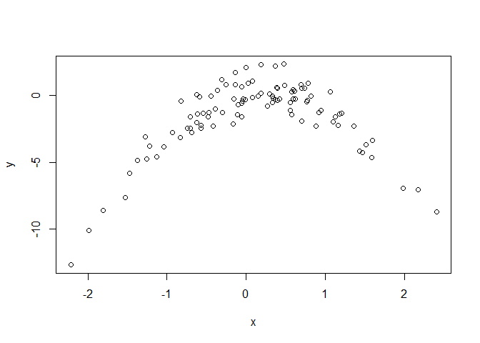

# Question 3 ISLR 5.4.8

```r
#Libraries

library(boot) # For LOOCV and K-Fold CV
library(MASS) # For Boston dataset
```

## Solution.

### Part (a)

```r
set.seed(1)
x <- rnorm(100)
y <- x - 2*x^2 + rnorm(100)
```

n = 100, and p = 2. The model is $Y = X - 2X^2 + \epsilon$.

### Part (b)

```r
plot(x, y)
```

<!-- -->

```r
cat(min(x), max(x))
```

```
## -2.2147 2.401618
```

```r
cat(min(y), max(y))
```

```
## -12.67519 2.331269
```

The shape of this plot is clearly that of a quadratic(although upside down from the typical $x^2$, still has the parabola shape). Most of the data seems centered around x = 0. Our x-values range from about -2.2 to 2.4 while our y-values range from roughly -12.68 to 2.33. 

### Part (c)

```r
set.seed(2)
df <- data.frame(x,y)

glm.fit1 <- glm(y ~ x)
glm.fit2 <- glm(y ~ poly(x, 2))
glm.fit3 <- glm(y ~ poly(x, 3))
glm.fit4 <- glm(y ~ poly(x, 4))

# Printing and assigning in same line to save space, not sure if we will use the err variables later or not though.
print(cv.err1 <- cv.glm(df, glm.fit1)$delta[1])
```

```
## [1] 7.288162
```

```r
print(cv.err2 <- cv.glm(df, glm.fit2)$delta[1])
```

```
## [1] 0.9374236
```

```r
print(cv.err3 <- cv.glm(df, glm.fit3)$delta[1])
```

```
## [1] 0.9566218
```

```r
print(cv.err4 <- cv.glm(df, glm.fit4)$delta[1])
```

```
## [1] 0.9539049
```

### Part (d)

```r
set.seed(3)
df <- data.frame(x,y)

glm.fit1 <- glm(y ~ x)
glm.fit2 <- glm(y ~ poly(x, 2))
glm.fit3 <- glm(y ~ poly(x, 3))
glm.fit4 <- glm(y ~ poly(x, 4))

# Printing and assigning in same line to save space like before, not sure if we will use the err variables later or not though.
print(cv.err1 <- cv.glm(df, glm.fit1)$delta[1])
```

```
## [1] 7.288162
```

```r
print(cv.err2 <- cv.glm(df, glm.fit2)$delta[1])
```

```
## [1] 0.9374236
```

```r
print(cv.err3 <- cv.glm(df, glm.fit3)$delta[1])
```

```
## [1] 0.9566218
```

```r
print(cv.err4 <- cv.glm(df, glm.fit4)$delta[1])
```

```
## [1] 0.9539049
```

Yes, the results are the same as LOOCV has no random component to it, we test on each individual data point eventually for our model so the order in which we pick doesn't really matter; results are the same.

### Part (e)
Model ii had the lowest LOOCV test error rate which is the quadratic polynomial$(Y = \beta_0 + \beta_1 X + \beta_2 X^2 + \epsilon)$. This makes sense because of the form of Y being quadratic as well.

### Part (f)

```r
# May not need all of these since values only change from fit1 to fit2 in terms of what's significant.
summary(glm.fit1)
```

```
## 
## Call:
## glm(formula = y ~ x)
## 
## Deviance Residuals: 
##     Min       1Q   Median       3Q      Max  
## -9.5161  -0.6800   0.6812   1.5491   3.8183  
## 
## Coefficients:
##             Estimate Std. Error t value Pr(>|t|)    
## (Intercept)  -1.6254     0.2619  -6.205 1.31e-08 ***
## x             0.6925     0.2909   2.380   0.0192 *  
## ---
## Signif. codes:  0 '***' 0.001 '**' 0.01 '*' 0.05 '.' 0.1 ' ' 1
## 
## (Dispersion parameter for gaussian family taken to be 6.760719)
## 
##     Null deviance: 700.85  on 99  degrees of freedom
## Residual deviance: 662.55  on 98  degrees of freedom
## AIC: 478.88
## 
## Number of Fisher Scoring iterations: 2
```

```r
summary(glm.fit2)
```

```
## 
## Call:
## glm(formula = y ~ poly(x, 2))
## 
## Deviance Residuals: 
##     Min       1Q   Median       3Q      Max  
## -1.9650  -0.6254  -0.1288   0.5803   2.2700  
## 
## Coefficients:
##             Estimate Std. Error t value Pr(>|t|)    
## (Intercept)  -1.5500     0.0958  -16.18  < 2e-16 ***
## poly(x, 2)1   6.1888     0.9580    6.46 4.18e-09 ***
## poly(x, 2)2 -23.9483     0.9580  -25.00  < 2e-16 ***
## ---
## Signif. codes:  0 '***' 0.001 '**' 0.01 '*' 0.05 '.' 0.1 ' ' 1
## 
## (Dispersion parameter for gaussian family taken to be 0.9178258)
## 
##     Null deviance: 700.852  on 99  degrees of freedom
## Residual deviance:  89.029  on 97  degrees of freedom
## AIC: 280.17
## 
## Number of Fisher Scoring iterations: 2
```

```r
summary(glm.fit3)
```

```
## 
## Call:
## glm(formula = y ~ poly(x, 3))
## 
## Deviance Residuals: 
##     Min       1Q   Median       3Q      Max  
## -1.9765  -0.6302  -0.1227   0.5545   2.2843  
## 
## Coefficients:
##              Estimate Std. Error t value Pr(>|t|)    
## (Intercept)  -1.55002    0.09626 -16.102  < 2e-16 ***
## poly(x, 3)1   6.18883    0.96263   6.429 4.97e-09 ***
## poly(x, 3)2 -23.94830    0.96263 -24.878  < 2e-16 ***
## poly(x, 3)3   0.26411    0.96263   0.274    0.784    
## ---
## Signif. codes:  0 '***' 0.001 '**' 0.01 '*' 0.05 '.' 0.1 ' ' 1
## 
## (Dispersion parameter for gaussian family taken to be 0.9266599)
## 
##     Null deviance: 700.852  on 99  degrees of freedom
## Residual deviance:  88.959  on 96  degrees of freedom
## AIC: 282.09
## 
## Number of Fisher Scoring iterations: 2
```

```r
summary(glm.fit4)
```

```
## 
## Call:
## glm(formula = y ~ poly(x, 4))
## 
## Deviance Residuals: 
##     Min       1Q   Median       3Q      Max  
## -2.0550  -0.6212  -0.1567   0.5952   2.2267  
## 
## Coefficients:
##              Estimate Std. Error t value Pr(>|t|)    
## (Intercept)  -1.55002    0.09591 -16.162  < 2e-16 ***
## poly(x, 4)1   6.18883    0.95905   6.453 4.59e-09 ***
## poly(x, 4)2 -23.94830    0.95905 -24.971  < 2e-16 ***
## poly(x, 4)3   0.26411    0.95905   0.275    0.784    
## poly(x, 4)4   1.25710    0.95905   1.311    0.193    
## ---
## Signif. codes:  0 '***' 0.001 '**' 0.01 '*' 0.05 '.' 0.1 ' ' 1
## 
## (Dispersion parameter for gaussian family taken to be 0.9197797)
## 
##     Null deviance: 700.852  on 99  degrees of freedom
## Residual deviance:  87.379  on 95  degrees of freedom
## AIC: 282.3
## 
## Number of Fisher Scoring iterations: 2
```

Yes, these results agree with conclusions from the cross-validation results as the third and fourth degree polynomial terms are seen as insignificant while the quadratic term and linear term are very significant.

# Question 3 


## Solution.

### Part (a)


```r
set.seed(17) # Like the book does it, will need to do in every code block though.

glm.fit <- glm(crim ~ ., data = Boston)
summary(glm.fit)
```

```
## 
## Call:
## glm(formula = crim ~ ., data = Boston)
## 
## Deviance Residuals: 
##    Min      1Q  Median      3Q     Max  
## -9.924  -2.120  -0.353   1.019  75.051  
## 
## Coefficients:
##               Estimate Std. Error t value Pr(>|t|)    
## (Intercept)  17.033228   7.234903   2.354 0.018949 *  
## zn            0.044855   0.018734   2.394 0.017025 *  
## indus        -0.063855   0.083407  -0.766 0.444294    
## chas         -0.749134   1.180147  -0.635 0.525867    
## nox         -10.313535   5.275536  -1.955 0.051152 .  
## rm            0.430131   0.612830   0.702 0.483089    
## age           0.001452   0.017925   0.081 0.935488    
## dis          -0.987176   0.281817  -3.503 0.000502 ***
## rad           0.588209   0.088049   6.680 6.46e-11 ***
## tax          -0.003780   0.005156  -0.733 0.463793    
## ptratio      -0.271081   0.186450  -1.454 0.146611    
## black        -0.007538   0.003673  -2.052 0.040702 *  
## lstat         0.126211   0.075725   1.667 0.096208 .  
## medv         -0.198887   0.060516  -3.287 0.001087 ** 
## ---
## Signif. codes:  0 '***' 0.001 '**' 0.01 '*' 0.05 '.' 0.1 ' ' 1
## 
## (Dispersion parameter for gaussian family taken to be 41.46327)
## 
##     Null deviance: 37363  on 505  degrees of freedom
## Residual deviance: 20400  on 492  degrees of freedom
## AIC: 3336.5
## 
## Number of Fisher Scoring iterations: 2
```

```r
print(cv.err <- cv.glm(Boston, glm.fit)$delta[1])
```

```
## [1] 42.96874
```

```r
print(cv.err10 <- cv.glm(Boston, glm.fit, K=10)$delta[1])
```

```
## [1] 42.93207
```

The **AIC is 3336.5**, the **LOOCV is 42.96874** and the **10-fold CV is 42.93207**.

DELT THIS

```r
se <- c(0)
for(i in 1:dim(Boston)[1]) {
  glm.fit <- glm(crim ~ ., data=Boston[-i, ])
  predicted <- predict(glm.fit, Boston[i, ])
  
  se <- se + (Boston[i, ] - predicted)^2
}
se <- se / dim(Boston)[1]
```

### Part (b)

**Age** has the highest p-value, so we will remove that one.


```r
set.seed(17)

ind <- (which(names(Boston)=="age"))
glm.fit <- glm(crim ~ ., data = Boston[,-ind])
summary(glm.fit)
```

```
## 
## Call:
## glm(formula = crim ~ ., data = Boston[, -ind])
## 
## Deviance Residuals: 
##    Min      1Q  Median      3Q     Max  
## -9.923  -2.116  -0.354   1.031  75.042  
## 
## Coefficients:
##               Estimate Std. Error t value Pr(>|t|)    
## (Intercept)  16.985714   7.203806   2.358 0.018769 *  
## zn            0.044673   0.018580   2.404 0.016569 *  
## indus        -0.063848   0.083323  -0.766 0.443879    
## chas         -0.744368   1.177490  -0.632 0.527572    
## nox         -10.202169   5.088019  -2.005 0.045495 *  
## rm            0.439588   0.600994   0.731 0.464861    
## dis          -0.993557   0.270306  -3.676 0.000263 ***
## rad           0.587660   0.087700   6.701 5.68e-11 ***
## tax          -0.003768   0.005148  -0.732 0.464618    
## ptratio      -0.269949   0.185739  -1.453 0.146754    
## black        -0.007519   0.003662  -2.053 0.040602 *  
## lstat         0.128120   0.071890   1.782 0.075337 .  
## medv         -0.198878   0.060455  -3.290 0.001075 ** 
## ---
## Signif. codes:  0 '***' 0.001 '**' 0.01 '*' 0.05 '.' 0.1 ' ' 1
## 
## (Dispersion parameter for gaussian family taken to be 41.37972)
## 
##     Null deviance: 37363  on 505  degrees of freedom
## Residual deviance: 20400  on 493  degrees of freedom
## AIC: 3334.5
## 
## Number of Fisher Scoring iterations: 2
```

```r
print(aic <- summary(glm.fit)$aic)
```

```
## [1] 3334.528
```

```r
print(cv.err <- cv.glm(Boston, glm.fit)$delta[1])
```

```
## [1] 42.96874
```

```r
print(cv.err10 <- cv.glm(Boston, glm.fit, K=10)$delta[1])
```

```
## [1] 42.93207
```

**AIC = 3334.5**

**LOOCV = 42.96874**

**10-fold CV = 42.93207**

### Part (c)


```r
set.seed(17)
largest <- 0.1
data_a <- Boston

# Variables for part (d) that use this code.
############
low_aic <- aic
low_loocv <- cv.err
low_10 <- cv.err10
############ 

while(largest >= 0.1)
{
  data_a <- data_a[,-ind] # Removes "age" like above in part (b).
  glm.fit <- glm(crim ~ ., data = data_a)
  print(summary(glm.fit))
  largest <- 0  
  
  for(i in 1:nrow(summary(glm.fit)$coefficients))
  {
    p_val <- summary(glm.fit)$coefficients[i,4]
    if(p_val > largest)
    {
      largest <- p_val
      ind <- i
    }
  }
  
  aic <- summary(glm.fit)$aic
  cv.err <- cv.glm(Boston, glm.fit)$delta[1]
  cv.err10 <- cv.glm(Boston, glm.fit, K=10)$delta[1]
  
  cat("       AIC: ", aic, "\n")
  cat("     LOOCV: ", cv.err, "\n")
  cat("10-fold CV: ", cv.err10, "\n\n")
  
  if(aic < low_aic)
  {
    low_aic <- aic
  }
  if(cv.err < low_loocv)
  {
    low_loocv <- cv.err
  }
  if(cv.err10 < low_10)
  {
    low_10 <- cv.err10
  }
}
```

```
## 
## Call:
## glm(formula = crim ~ ., data = data_a)
## 
## Deviance Residuals: 
##    Min      1Q  Median      3Q     Max  
## -9.923  -2.116  -0.354   1.031  75.042  
## 
## Coefficients:
##               Estimate Std. Error t value Pr(>|t|)    
## (Intercept)  16.985714   7.203806   2.358 0.018769 *  
## zn            0.044673   0.018580   2.404 0.016569 *  
## indus        -0.063848   0.083323  -0.766 0.443879    
## chas         -0.744368   1.177490  -0.632 0.527572    
## nox         -10.202169   5.088019  -2.005 0.045495 *  
## rm            0.439588   0.600994   0.731 0.464861    
## dis          -0.993557   0.270306  -3.676 0.000263 ***
## rad           0.587660   0.087700   6.701 5.68e-11 ***
## tax          -0.003768   0.005148  -0.732 0.464618    
## ptratio      -0.269949   0.185739  -1.453 0.146754    
## black        -0.007519   0.003662  -2.053 0.040602 *  
## lstat         0.128120   0.071890   1.782 0.075337 .  
## medv         -0.198878   0.060455  -3.290 0.001075 ** 
## ---
## Signif. codes:  0 '***' 0.001 '**' 0.01 '*' 0.05 '.' 0.1 ' ' 1
## 
## (Dispersion parameter for gaussian family taken to be 41.37972)
## 
##     Null deviance: 37363  on 505  degrees of freedom
## Residual deviance: 20400  on 493  degrees of freedom
## AIC: 3334.5
## 
## Number of Fisher Scoring iterations: 2
## 
##        AIC:  3334.528 
##      LOOCV:  42.96874 
## 10-fold CV:  42.93207 
## 
## 
## Call:
## glm(formula = crim ~ ., data = data_a)
## 
## Deviance Residuals: 
##    Min      1Q  Median      3Q     Max  
## -9.906  -2.133  -0.315   1.065  75.055  
## 
## Coefficients:
##               Estimate Std. Error t value Pr(>|t|)    
## (Intercept)  17.096653   7.197290   2.375 0.017909 *  
## zn            0.044859   0.018566   2.416 0.016049 *  
## indus        -0.069177   0.082845  -0.835 0.404117    
## nox         -10.458590   5.068742  -2.063 0.039601 *  
## rm            0.445708   0.600550   0.742 0.458339    
## dis          -0.997154   0.270082  -3.692 0.000247 ***
## rad           0.583934   0.087449   6.677 6.56e-11 ***
## tax          -0.003455   0.005121  -0.675 0.500266    
## ptratio      -0.265328   0.185482  -1.430 0.153212    
## black        -0.007599   0.003658  -2.077 0.038277 *  
## lstat         0.127215   0.071832   1.771 0.077177 .  
## medv         -0.204431   0.059777  -3.420 0.000678 ***
## ---
## Signif. codes:  0 '***' 0.001 '**' 0.01 '*' 0.05 '.' 0.1 ' ' 1
## 
## (Dispersion parameter for gaussian family taken to be 41.32943)
## 
##     Null deviance: 37363  on 505  degrees of freedom
## Residual deviance: 20417  on 494  degrees of freedom
## AIC: 3332.9
## 
## Number of Fisher Scoring iterations: 2
## 
##        AIC:  3332.938 
##      LOOCV:  42.96874 
## 10-fold CV:  42.8935 
## 
## 
## Call:
## glm(formula = crim ~ ., data = data_a)
## 
## Deviance Residuals: 
##    Min      1Q  Median      3Q     Max  
## -9.881  -2.117  -0.328   1.059  75.097  
## 
## Coefficients:
##               Estimate Std. Error t value Pr(>|t|)    
## (Intercept)  16.385799   7.115806   2.303 0.021708 *  
## zn            0.041863   0.018018   2.323 0.020560 *  
## indus        -0.093304   0.074686  -1.249 0.212151    
## nox         -10.621745   5.060181  -2.099 0.036315 *  
## rm            0.448283   0.600208   0.747 0.455491    
## dis          -0.990773   0.269767  -3.673 0.000266 ***
## rad           0.535664   0.050239  10.662  < 2e-16 ***
## ptratio      -0.269561   0.185274  -1.455 0.146321    
## black        -0.007595   0.003656  -2.077 0.038288 *  
## lstat         0.130846   0.071591   1.828 0.068197 .  
## medv         -0.198001   0.058979  -3.357 0.000848 ***
## ---
## Signif. codes:  0 '***' 0.001 '**' 0.01 '*' 0.05 '.' 0.1 ' ' 1
## 
## (Dispersion parameter for gaussian family taken to be 41.28393)
## 
##     Null deviance: 37363  on 505  degrees of freedom
## Residual deviance: 20436  on 495  degrees of freedom
## AIC: 3331.4
## 
## Number of Fisher Scoring iterations: 2
## 
##        AIC:  3331.404 
##      LOOCV:  42.96874 
## 10-fold CV:  42.73634 
## 
## 
## Call:
## glm(formula = crim ~ ., data = data_a)
## 
## Deviance Residuals: 
##    Min      1Q  Median      3Q     Max  
## -9.946  -2.086  -0.358   0.974  75.644  
## 
## Coefficients:
##               Estimate Std. Error t value Pr(>|t|)    
## (Intercept)  19.124636   6.095437   3.138 0.001805 ** 
## zn            0.042788   0.017967   2.381 0.017620 *  
## indus        -0.099386   0.074207  -1.339 0.181085    
## nox         -10.466490   5.053655  -2.071 0.038869 *  
## dis          -1.002598   0.269182  -3.725 0.000218 ***
## rad           0.539504   0.049953  10.800  < 2e-16 ***
## ptratio      -0.270836   0.185183  -1.463 0.144230    
## black        -0.008004   0.003613  -2.215 0.027199 *  
## lstat         0.117806   0.069398   1.698 0.090223 .  
## medv         -0.180594   0.054155  -3.335 0.000918 ***
## ---
## Signif. codes:  0 '***' 0.001 '**' 0.01 '*' 0.05 '.' 0.1 ' ' 1
## 
## (Dispersion parameter for gaussian family taken to be 41.24713)
## 
##     Null deviance: 37363  on 505  degrees of freedom
## Residual deviance: 20459  on 496  degrees of freedom
## AIC: 3330
## 
## Number of Fisher Scoring iterations: 2
## 
##        AIC:  3329.974 
##      LOOCV:  42.96874 
## 10-fold CV:  42.4803 
## 
## 
## Call:
## glm(formula = crim ~ ., data = data_a)
## 
## Deviance Residuals: 
##    Min      1Q  Median      3Q     Max  
## -9.860  -2.102  -0.363   0.895  75.702  
## 
## Coefficients:
##               Estimate Std. Error t value Pr(>|t|)    
## (Intercept)  19.683128   6.086010   3.234 0.001301 ** 
## zn            0.043293   0.017977   2.408 0.016394 *  
## nox         -12.753708   4.760157  -2.679 0.007623 ** 
## dis          -0.918318   0.261932  -3.506 0.000496 ***
## rad           0.532617   0.049727  10.711  < 2e-16 ***
## ptratio      -0.310541   0.182941  -1.697 0.090229 .  
## black        -0.007922   0.003615  -2.191 0.028897 *  
## lstat         0.110173   0.069219   1.592 0.112097    
## medv         -0.174207   0.053988  -3.227 0.001334 ** 
## ---
## Signif. codes:  0 '***' 0.001 '**' 0.01 '*' 0.05 '.' 0.1 ' ' 1
## 
## (Dispersion parameter for gaussian family taken to be 41.313)
## 
##     Null deviance: 37363  on 505  degrees of freedom
## Residual deviance: 20533  on 497  degrees of freedom
## AIC: 3329.8
## 
## Number of Fisher Scoring iterations: 2
## 
##        AIC:  3329.8 
##      LOOCV:  42.96874 
## 10-fold CV:  43.50741 
## 
## 
## Call:
## glm(formula = crim ~ ., data = data_a)
## 
## Deviance Residuals: 
##     Min       1Q   Median       3Q      Max  
## -10.037   -2.001   -0.403    0.978   75.177  
## 
## Coefficients:
##               Estimate Std. Error t value Pr(>|t|)    
## (Intercept)  22.711289   5.789892   3.923 9.99e-05 ***
## zn            0.044887   0.017977   2.497   0.0129 *  
## nox         -12.185035   4.754032  -2.563   0.0107 *  
## dis          -1.017202   0.254849  -3.991 7.56e-05 ***
## rad           0.541198   0.049510  10.931  < 2e-16 ***
## ptratio      -0.331186   0.182761  -1.812   0.0706 .  
## black        -0.008098   0.003619  -2.237   0.0257 *  
## medv         -0.228833   0.041739  -5.482 6.68e-08 ***
## ---
## Signif. codes:  0 '***' 0.001 '**' 0.01 '*' 0.05 '.' 0.1 ' ' 1
## 
## (Dispersion parameter for gaussian family taken to be 41.44021)
## 
##     Null deviance: 37363  on 505  degrees of freedom
## Residual deviance: 20637  on 498  degrees of freedom
## AIC: 3330.4
## 
## Number of Fisher Scoring iterations: 2
## 
##        AIC:  3330.373 
##      LOOCV:  42.96874 
## 10-fold CV:  42.71068
```

I print the AIC, LOOCV, and 10-fold CV together after each summary. It might be hard to find? Summaries are printed to show what is being removed with each iteration of the loop.  I'll print here as well in the order they appear after removal of highest p-values(assuming *age* already removed).

AIC:  3335.028,
LOOCV:  42.96874, 
10-fold CV:  42.93207 

AIC:  3333.077, 
LOOCV:  42.96874, 
10-fold CV:  42.8935 

AIC:  3331.502, 
LOOCV:  42.96874, 
10-fold CV:  42.73634 

AIC:  3329.974, 
LOOCV:  42.96874, 
10-fold CV:  42.4803

AIC:  3329.8, 
LOOCV:  42.96874, 
10-fold CV:  43.50741

AIC:  3330.373, 
LOOCV:  42.96874, 
10-fold CV:  42.71068 

### Part (d)


```r
low_aic
```

```
## [1] 3329.8
```

```r
low_loocv
```

```
## [1] 42.96874
```

```r
low_10
```

```
## [1] 42.4803
```

The values in the previous block are from the loops in part (c). We can see the lowest values are as follows:

**AIC: 3329.8**

**LOOCV: 42.96874**

**10-fold CV: 42.4803**

From the above we can see the LOOCV values never change for our models(which makes sense because we have 7 predictors remaining after maxmimum removals, removing one more may have changed the LOOCV), so we can look strictly at the AIC and 10-fold CV. We also are not looking at higher degree polynomial models so interpretability isn't a *huge* concern. 

The lowest AIC value(3329.8) came from the second to last model where the corresponding 10-fold CV value was 43.50741.

The lowest 10-fold CV value(42.4803) came from the third to last model where the corresponding AIC value was 3329.974. 

Because of the AIC only being .174 away from the lowest value in the third model where the 10-fold CV value is the lowest(and the gap is larger to the 10-fold CV value in the model with the lowest AIC value), I would choose the third to last model. This is the model using *zn, indus, nox, dis, rad, ptratio, black, lstat, * and *medv* as the predictors. 

Hopefully this came out correct! I know we can eyeball it, but if we have a large data set that makes it hard to see and do some simple queries on I figured this way would be *somewhat* useful, even though it takes a few seconds for it to run haha. 
