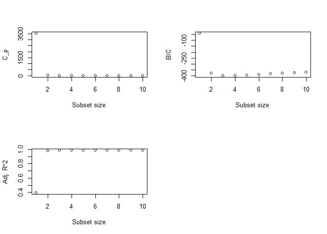
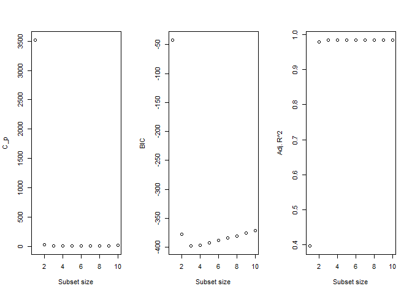
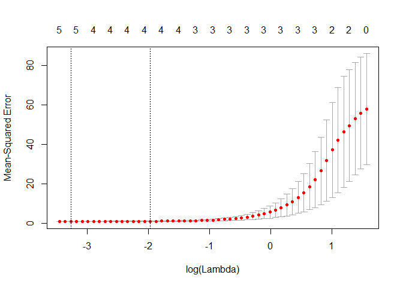

```r
library(leaps) # For regsubsets()
```

```
## Warning: package 'leaps' was built under R version 3.4.4
```

```r
library(glmnet) # For Lasso
```

```
## Warning: package 'glmnet' was built under R version 3.4.4
```

```
## Loading required package: Matrix
```

```
## Loading required package: foreach
```

```
## Warning: package 'foreach' was built under R version 3.4.4
```

```
## Loaded glmnet 2.0-16
```

```r
library(ISLR) # For College data set in Number 6.8.9
```

```
## Warning: package 'ISLR' was built under R version 3.4.4
```

# Question 4 ISLR 6.8.8

## Solution.

### Part (a)


```r
set.seed(1)
X <- rnorm(100)
eps <- rnorm(100)
```

### Part (b)

Using $(\beta_0, \beta_1, \beta_2, \beta_3)$ = (10, 1, -5, 2)

```r
Y <- 10 + X - 5*X^2 + 2*X^3 + eps
```

### Part (c)

```r
full.data <- data.frame("x" = X, "y" = Y)
full.model <- regsubsets(y ~ poly(x, 10, raw=T), data=full.data, nvmax=10)
model.summary <- summary(full.model)
```

Finding minimum values for $C_p$, BIC, and maximum for Adjusted $R^2$, along with plots: 

Minimum values:

```r
min(model.summary$cp)
```

```
## [1] 0.6067483
```

```r
min(model.summary$bic)
```

```
## [1] -397.8565
```

```r
max(model.summary$adjr2)
```

```
## [1] 0.9843967
```

Smallest $C_p$ is 0.607, BIC is -397.857, and max Adjusted $R^2$ is 0.984.

Subset selections for minimum values(max for $R^2$:


```r
print(min_cp_ind <- which(model.summary$cp == min(model.summary$cp)))
```

```
## [1] 4
```

```r
print(min_bic_ind <- which(model.summary$bic == min(model.summary$bic)))
```

```
## [1] 3
```

```r
print(max_r2_ind <- which(model.summary$adjr2 == max(model.summary$adjr2)))
```

```
## [1] 4
```

```r
par(mfrow = c(2,2))
plot(model.summary$cp, xlab = "Subset size", ylab = "C_p")
plot(model.summary$bic, xlab = "Subset size", ylab = "BIC")
plot(model.summary$adjr2, xlab = "Subset size", ylab = "Adj. R^2")
```

<!-- -->

We see from the above that using 4 variables(5 predictors, including the intercept) gives the lowest $C_p$, while 3 variables gives the lowest BIC, and 4 variables gives the highest Adjusted $R^2$.


```r
coef(full.model, min_cp_ind)
```

```
##           (Intercept) poly(x, 10, raw = T)1 poly(x, 10, raw = T)2 
##           10.07200775            1.38745596           -5.15424359 
## poly(x, 10, raw = T)3 poly(x, 10, raw = T)5 
##            1.55797426            0.08072292
```

```r
coef(full.model, min_bic_ind)
```

```
##           (Intercept) poly(x, 10, raw = T)1 poly(x, 10, raw = T)2 
##            10.0615072             0.9752803            -5.1237910 
## poly(x, 10, raw = T)3 
##             2.0176386
```

```r
coef(full.model, max_r2_ind)
```

```
##           (Intercept) poly(x, 10, raw = T)1 poly(x, 10, raw = T)2 
##           10.07200775            1.38745596           -5.15424359 
## poly(x, 10, raw = T)3 poly(x, 10, raw = T)5 
##            1.55797426            0.08072292
```

### Part (d)

```r
forward.model <- regsubsets(y ~ poly(x, 10, raw=T), data=full.data, nvmax=10, method="forward")
backward.model <- regsubsets(y ~ poly(x, 10, raw=T), data=full.data, nvmax=10, method="backward")
forward.summary <- summary(forward.model)
backward.summary <- summary(backward.model)
```

Finding minimum values of for $C_p$, BIC, and maximum for Adjusted $R^2$, along with plots: 

Values:

```r
min(forward.summary$cp)
```

```
## [1] 0.6067483
```

```r
min(forward.summary$bic)
```

```
## [1] -397.8565
```

```r
max(forward.summary$adjr2)
```

```
## [1] 0.9843967
```

```r
min(backward.summary$cp)
```

```
## [1] 0.9808795
```

```r
min(backward.summary$bic)
```

```
## [1] -397.8565
```

```r
max(backward.summary$adjr2)
```

```
## [1] 0.9843322
```

Forward selection: Minimum for $C_p$ = 1.866, BIC = -397.857, max Adjusted $R^2$ = 0.984.

Backward selection: Minimum for $C_p$ = 1.866, BIC = -397.857, max Adjusted $R^2$ = 0.984

Same values for both backward and forward.

Subset selections:


```r
print(min_cp_ind_f <- which(forward.summary$cp == min(forward.summary$cp)))
```

```
## [1] 4
```

```r
print(min_bic_ind_f <- which(forward.summary$bic == min(forward.summary$bic)))
```

```
## [1] 3
```

```r
print(max_r2_ind_f <- which(forward.summary$adjr2 == max(forward.summary$adjr2)))
```

```
## [1] 4
```

```r
print(min_cp_ind_b <- which(backward.summary$cp == min(backward.summary$cp)))
```

```
## [1] 4
```

```r
print(min_bic_ind_b <- which(backward.summary$bic == min(backward.summary$bic)))
```

```
## [1] 3
```

```r
print(max_r2_ind_b <- which(backward.summary$adjr2 == max(backward.summary$adjr2)))
```

```
## [1] 4
```

```r
par(mfrow = c(1,3))

plot(forward.summary$cp, xlab = "Subset size", ylab = "C_p")
plot(forward.summary$bic, xlab = "Subset size", ylab = "BIC")
plot(forward.summary$adjr2, xlab = "Subset size", ylab = "Adj. R^2")
```

<!-- -->

```r
plot(backward.summary$cp, xlab = "Subset size", ylab = "C_p")
plot(backward.summary$bic, xlab = "Subset size", ylab = "BIC")
plot(backward.summary$adjr2, xlab = "Subset size", ylab = "Adj. R^2")
```

<!-- -->

Yes, these results agree with the results from part *c*. Here are the coefficients(The first three runs are forward selection, the last three are backward selection): 


```r
coef(forward.model, min_cp_ind_f)
```

```
##           (Intercept) poly(x, 10, raw = T)1 poly(x, 10, raw = T)2 
##           10.07200775            1.38745596           -5.15424359 
## poly(x, 10, raw = T)3 poly(x, 10, raw = T)5 
##            1.55797426            0.08072292
```

```r
coef(forward.model, min_bic_ind_f)
```

```
##           (Intercept) poly(x, 10, raw = T)1 poly(x, 10, raw = T)2 
##            10.0615072             0.9752803            -5.1237910 
## poly(x, 10, raw = T)3 
##             2.0176386
```

```r
coef(forward.model, max_r2_ind_f)
```

```
##           (Intercept) poly(x, 10, raw = T)1 poly(x, 10, raw = T)2 
##           10.07200775            1.38745596           -5.15424359 
## poly(x, 10, raw = T)3 poly(x, 10, raw = T)5 
##            1.55797426            0.08072292
```

```r
coef(backward.model, min_cp_ind_b)
```

```
##           (Intercept) poly(x, 10, raw = T)1 poly(x, 10, raw = T)2 
##          10.079236362           1.231905828          -5.166505820 
## poly(x, 10, raw = T)3 poly(x, 10, raw = T)9 
##           1.819555807           0.001290827
```

```r
coef(backward.model, min_bic_ind_b)
```

```
##           (Intercept) poly(x, 10, raw = T)1 poly(x, 10, raw = T)2 
##            10.0615072             0.9752803            -5.1237910 
## poly(x, 10, raw = T)3 
##             2.0176386
```

```r
coef(backward.model, max_r2_ind_b)
```

```
##           (Intercept) poly(x, 10, raw = T)1 poly(x, 10, raw = T)2 
##          10.079236362           1.231905828          -5.166505820 
## poly(x, 10, raw = T)3 poly(x, 10, raw = T)9 
##           1.819555807           0.001290827
```

### Part (e)

```r
x_mat <- model.matrix(y ~ poly(x, 10, raw=T), data = full.data)[,-1] # Don't want the intercept term I believe
lasso.model <- cv.glmnet(x_mat, Y, alpha=1) # alpha = 1 implies Lasso, 0 implies Ridge I think.
print(min_lambda <- lasso.model$lambda.min)
```

```
## [1] 0.03800447
```

```r
plot(lasso.model)
```

<!-- -->

Now to fit the model using our smallest lambda and show the coefficients:


```r
predict(glmnet(x_mat, Y, alpha = 1), s = min_lambda, type = "coefficients")
```

```
## 11 x 1 sparse Matrix of class "dgCMatrix"
##                                    1
## (Intercept)             1.004102e+01
## poly(x, 10, raw = T)1   1.268332e+00
## poly(x, 10, raw = T)2  -5.106011e+00
## poly(x, 10, raw = T)3   1.655907e+00
## poly(x, 10, raw = T)4   .           
## poly(x, 10, raw = T)5   6.098822e-02
## poly(x, 10, raw = T)6   .           
## poly(x, 10, raw = T)7   9.462569e-05
## poly(x, 10, raw = T)8   .           
## poly(x, 10, raw = T)9   .           
## poly(x, 10, raw = T)10  .
```

The results show that for lasso we should use 5 predictors(6 if you include the intercept term), which are the first, second, third, fifth, and seventh degree polynomial terms. 

However, the fifth and seventh degree polynomials are both small values(.06 and .00009 respectively) and hurt the interpretability of the model quite a bit. The seventh degree term can almost certainly be taken out, and the fifth degree term may be able to be removed as well. I'm not sure how this would affect our results regarding lambda and such if we were to remove them, though.

### Part (f)

Using $(\beta_0, \beta_7)$ = (10, 2)


```r
Y <- 10 + 2*X^7 + eps
```

#### Best subset


```r
full.data <- data.frame("x" = X, "y" = Y)
full.model <- regsubsets(y ~ poly(x, 10, raw=T), data=full.data, nvmax=10)
model.summary <- summary(full.model)

print(min_cp_ind <- which(model.summary$cp == min(model.summary$cp)))
```

```
## [1] 2
```

```r
print(min_bic_ind <- which(model.summary$bic == min(model.summary$bic)))
```

```
## [1] 1
```

```r
print(max_r2_ind <- which(model.summary$adjr2 == max(model.summary$adjr2)))
```

```
## [1] 4
```

```r
coef(full.model, min_cp_ind)
```

```
##           (Intercept) poly(x, 10, raw = T)2 poly(x, 10, raw = T)7 
##            10.0704904            -0.1417084             2.0015552
```

```r
coef(full.model, min_bic_ind)
```

```
##           (Intercept) poly(x, 10, raw = T)7 
##               9.95894               2.00077
```

```r
coef(full.model, max_r2_ind)
```

```
##           (Intercept) poly(x, 10, raw = T)1 poly(x, 10, raw = T)2 
##            10.0762524             0.2914016            -0.1617671 
## poly(x, 10, raw = T)3 poly(x, 10, raw = T)7 
##            -0.2526527             2.0091338
```

#### Lasso


```r
x_mat <- model.matrix(y ~ poly(x, 10, raw=T), data = full.data)[,-1]
lasso.model <- cv.glmnet(x_mat, Y, alpha=1)
print(min_lambda <- lasso.model$lambda.min)
```

```
## [1] 3.879577
```

```r
predict(glmnet(x_mat, Y, alpha = 1), s = min_lambda, type = "coefficients")
```

```
## 11 x 1 sparse Matrix of class "dgCMatrix"
##                               1
## (Intercept)            10.22909
## poly(x, 10, raw = T)1   .      
## poly(x, 10, raw = T)2   .      
## poly(x, 10, raw = T)3   .      
## poly(x, 10, raw = T)4   .      
## poly(x, 10, raw = T)5   .      
## poly(x, 10, raw = T)6   .      
## poly(x, 10, raw = T)7   1.93676
## poly(x, 10, raw = T)8   .      
## poly(x, 10, raw = T)9   .      
## poly(x, 10, raw = T)10  .
```

The lasso model shows only one predictor and the intercept term, which is consistent with the best subset selection in regards to BIC as they both use the seventh degree polynomial term. The same seventh degree term is used in all of the cases that give the highest $R^2$, lowest BIC, and the lowest $C_p$ values as well as being the only polynomial term in the Lasso, so it's probably an important predictor. Some of the others for $R^2$ and $C_p$ from best subset are fairly small so many not really be necessary, and the Lasso shows that by removing them. 

# Question 5 ISLR 6.8.9


## Solution.

### Part (a)


```r
set.seed(1)
sum(is.na(College)) # Checking if any na values.
```

```
## [1] 0
```

```r
train <- sample(1:nrow(College), size = floor(.5*nrow(College)))
test <- -train

train.set <- College[train,]
test.set <- College[test,]
```

Now just to make sure of no overlap:


```r
dim(train.set)
```

```
## [1] 388  18
```

```r
dim(test.set)
```

```
## [1] 389  18
```

```r
intersect(train.set, test.set)
```

```
## data frame with 0 columns and 0 rows
```

```r
dim(setdiff(test.set, train.set))
```

```
## [1] 389  18
```

The dimensions are off by one which is good, not exactly a 50/50 split can be done. Intersection is empty and the difference between the sets is equal to the larger of the two sets, which is good. So we made the validation set well.

### Part (b)

```r
set.seed(1)
fit <- regsubsets(Apps ~ ., data=train.set, nvmax=10)

fit <- glm(Apps~., data=train.set)
pred <- predict(fit, test.set)
mean((test.set$Apps - pred)^2) # Test RSS
```

```
## [1] 1108531
```

```r
summary(fit)$aic
```

```
## [1] 6545.895
```

The AIC using best subset selection is 6545.895. Test RSS is 1108531.

### Part (c)

```r
set.seed(1)
train.matrix <- model.matrix(Apps~., data=train.set)
test.matrix <- model.matrix(Apps~., data=test.set)

grid <- 10^seq(4, -2, length=100)

ridge <- cv.glmnet(train.matrix, train.set$Apps, alpha=0, lambda=grid)

bestlam <- ridge$lambda.min

ridge.prediction <- predict(ridge, newx=test.matrix, s=bestlam)
mean((test.set$Apps - ridge.prediction)^2) # Test RSS
```

```
## [1] 1108296
```

Test RSS is 1108296.

### Part (d)

```r
set.seed(1)
lasso <- cv.glmnet(train.matrix, train.set$Apps, alpha=1, lambda=grid)
bestlam_lasso <- lasso$lambda.min
lasso.prediction <- predict(lasso, newx=test.matrix, s=bestlam_lasso)

mean((test.set$Apps - lasso.prediction)^2)
```

```
## [1] 1031016
```

Test RSS is 1031016. 

### Part (g)
Before I start, I figured maybe I could do something like the following command to get the coefficients and plug them into a regular linear model to get AIC or something but can't think of how right now with so many other things going on recently. Given the time I'm sure I could, but I have to get this in soon because Friday I'm loaded all day and don't have anything with me to do this on, also won't be home until Sunday.


```r
predict(lasso, newx=test.matrix, s=bestlam_lasso, type="coefficients")
```

```
## 19 x 1 sparse Matrix of class "dgCMatrix"
##                         1
## (Intercept) -3.639509e+02
## (Intercept)  .           
## PrivateYes  -5.240957e+02
## Accept       1.559845e+00
## Enroll      -4.545998e-01
## Top10perc    5.010066e+01
## Top25perc   -9.660075e+00
## F.Undergrad -9.353031e-03
## P.Undergrad  .           
## Outstate    -5.710904e-02
## Room.Board   1.944864e-01
## Books        1.812199e-02
## Personal     2.727728e-03
## PhD         -4.613893e+00
## Terminal    -3.120010e+00
## S.F.Ratio    .           
## perc.alumni -2.156690e+00
## Expend       3.278105e-02
## Grad.Rate    3.371339e+00
```

The $RSS_{test}$ for the linear model with best subset selection(part b) was the highest, with ridge slightly below it and lasso further below it. Of course, these are just small differences with such a large number. But the Lasso reduces some of the coefficients to 0. I'm not entirely sure how *accurately* we can predict, but these methods all seem to work pretty well for estimating number of college apps. I could brute force my way to $R^2$ values and maybe something like Mallow's $C_p$ as well as AIC/BIC? But I'm not sure that's what you're looking for. 

Based on just what I'm thinking, all of these should be accurate and they are all close to each other in Test RSS, so I assume similar for these other model assessers. 
